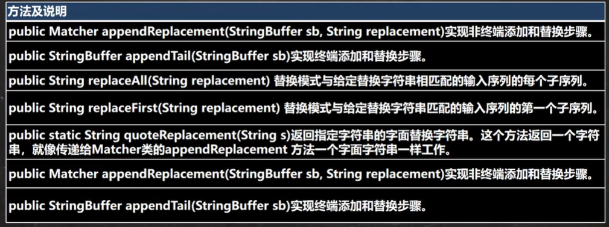
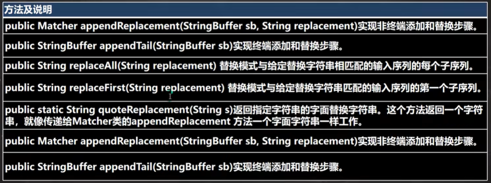

## 正则表达式

案例引入：提取一段字符串中的所有数字：

```java
content = "...";  // 一段字符串文本
// 1. 创建一个Pattern对象，模式对象，理解为是一个正则表达式对象
String regstr = "\\d\\d\\d\\d";   // \\d表示一个任意的数字
Pattern pattern = Pattern.compile(regStr);
// 2. 创建一个匹配器对象
Matcher matcher = pattern.matcher(content);
// 开始循环匹配
while(matcher.find()) {
    // 匹配内容，文本放到matcher.group(0)中
    System.out.println("找到:" + matcher.group(0));
}
```

***

### 基本介绍

正则表达式（`regular expression`，简写为`RegExp`）是对字符串执行模式匹配的技术（就是用某种模式去匹配字符串的一个公式），很多的编程语言都支持使用正则表达式

使用正则表达式是处理文本的利器，使用正则表达式可以大幅度提高我们的开发效率

***

### 底层实现

对于引入案例的说明：

1. 定义正则表达式的规则（本质上也是一个字符串），如`String regstr = "\\d\\d\\d\\d"`

2. 创建模式对象（即正则表达式对象），如：`Pattern pattern = Pattern.compile(regstr);`

3. 创建匹配器对象，如：`Matcher matcher = pattern.matcher(content);`

   匹配器对象，按照正则表达式的规则去匹配对应的字符串`content`

4. 进行循环匹配

   ```java
   while(matcher.find()) {
       // 匹配内容，文本放到matcher.group(0)中
       System.out.println("找到:" + matcher.group(0));
   }
   ```

   > - `matcher.find()`完成的任务（底层的分析）：
   >   1. 根据指定的规则，定位满足规则的子字符串（比如2000，在要匹配的字符串开头）
   >   2. 找到后，将子字符串的开始索引记录到`matcher`对象的属性`int[] groups;`中，其数组的初始默认值都为`-1`，`groups[0] = 0`（记录的0表示符合匹配的开始位置下标索引），把该子字符串的结束的索引+1的值记录到`groups[1] = 4`，同时记录`oldLast`的值为子字符串的结束的索引+1的值，即下次执行`find`时，就从`oldLast`的值4开始进行匹配（总而言之，`groups[0]`记录着符合匹配条件的子字符串在原字符串中开始位置的索引，`groups[1]`记录着结束位置的索引加一）
   > - `matcher.group(0)`完成的任务（底层的分析）：
   >   1. 根据`groups[0]`和`groups[1]`记录的位置，从`content`开始截取子字符串（不包括）`groups[1]`），并返回

分组：在正则表达式字符串中存在小括号就表示分组，第一个小括号包裹的内容称为第一组，第二个小括号包裹的内容称为第二组，以此类推：`String regStr = "(\\d\\d)(\\d\\d)"`

对于分组的底层分析：

> - `matcher.find()`完成的任务（底层的分析）：
>
>   1. 根据指定的规则，定位满足规则的子字符串（比如2000，在要匹配的字符串开头）
>   2. 找到后，将子字符串的开始索引记录到`matcher`对象的属性`int[] groups;`中，其数组的初始默认值都为`-1`，`groups[0] = 0`（记录的0表示符合匹配的开始位置下标索引），把该子字符串的结束的索引+1的值记录到`groups[1] = 4`
>      1. 记录第一组分组匹配到的字符串`groups[2] = 0`（第一组分组子字符串开始的索引位置）和`groups[3] = 2`（第二组分组子字符串结束的索引位置加一）
>      2. 记录第二组分组匹配到的字符串`groups[4] = 2`（第一组分组子字符串开始的索引位置）和`groups[5] = 4`（第二组分组子字符串结束的索引位置加一）
>      3. 如果有更多的分组，则以此类推
>   3. 同时记录`oldLast`的值为子字符串的结束的索引+1的值，即下次执行`find`时，就从`oldLast`的值4开始进行匹配（总而言之，`groups[0]`记录着符合匹配条件的子字符串在原字符串中开始位置的索引，`groups[1]`记录着结束位置的索引加一）
>
> - `matcher.group(*)`完成的任务（底层的分析）：
>
>   1. `matcher.group(0)`根据`groups[0]`和`groups[1]`记录的位置，从`content`开始截取子字符串（不包括）`groups[1]`），并返回（即匹配到的子字符串）
>
>   2. `matcher.group(1)`根据`groups[2]`和`groups[3]`记录的位置，从`content`开始截取子字符串（不包括）`groups[3]`），并返回（即匹配到的子字符串的第一组字串）
>
>   3. `matcher.group(2)`根据`groups[4]`和`groups[5]`记录的位置，从`content`开始截取子字符串（不包括）`groups[5]`），并返回（即匹配到的子字符串的第二组字串）
>
>      注意：分组数取值不能越界`matcher.group(3)`会报错

***

### 元字符

正则表达式的语法通过元字符组成，元字符从功能上大致分为：限定符、选择匹配符、分组组合和反向引用符、特殊字符、字符匹配符和定位符

#### 特殊字符

元字符的转义号`\\`（在我们使用正则表达式去检索某些特殊字符的时候，需要用到转义负号，否则是检索不到结果的，甚至出现报错）

需要使用到转义符号的字符有：`. * + () $ / \ ? [] ^ {}`

特殊说明：在`Java`语言中，转义号为`\\`，在其他的语言中，转义号为`\`

#### 字符匹配符

常见的字符匹配符有：

| 符号  |                         描述                         |      示例      |                          解释                           |
| :---: | :--------------------------------------------------: | :------------: | :-----------------------------------------------------: |
| `[]`  |                  可接收的字符串列表                  |    `[efgh]`    |           `e`、`f`、`g`、`h`中的任意一个字符            |
| `[^]` |                  不接收的字符串列表                  |    `[^abc]`    | 除了`a`、`b`、`c`之外的任意一个字符，包括数字和特殊符号 |
|  `-`  |                        连字符                        |    `[A-Z]`     |                    任意单个大写字母                     |
|  `.`  |               匹配除`\n`以外的任意字符               |     `a..b`     |   以`a`开头，`b`结尾，中间包括两个任意字符，且长度为4   |
| `\\d` |           匹配单个数字字符，相当于`[0-9]`            | `\\d{3}(\\d)?` |               包含三个或四个数字的字符串                |
| `\\D` |         匹配单个非数字字符串，相当于`[^0-9]`         |  `\\D(\\d)*`   |       以单个非数字字符开头，后接任意个数字字符串        |
| `\\w` |  匹配单个数字、大小写字母字符，相当于`[0-9a-zA-Z]`   | `\\d{3}\\w{4}` |       以三个数字字符开头的长度为7的数字字母字符串       |
| `\\W` | 匹配单个非数字、大小写字母字符，相当于`[^0-9a-zA-Z]` |  `\\W+\\d{2}`  | 以至少一个非数字字母字符开头，两个数字字符结尾的字符串  |
| `\\s` |          匹配任何空白字符（空格，制表符等）          |     `\\S`      |                   匹配任何非空白字符                    |

> 对于之前演示案例的`\\d\\d\\d`，我们可以简写为`\\d{3}`
>
> `?`表示前面的内容有可能有，也有可能没有
>
> `+`表示一到多，至少是有一个（紧跟在字符匹配符，说明前面匹配符的类型至少有一个）

`Java`正则表达式是默认区分字母大小写的，但是可以经过如下的设置，来实现不区分大小写：

- `(?i)abc`：表示匹配的`abc`都不区分大小写

- `a(?i)bc`：表示 `bc`不区分大小写

- `a((?i)b)c`：表示只有`b`不区分大小写

- 或者在全局进行设置，使正则表达式匹配都不区分大小写：

  ```java
  Pattern pat = Pattern,compile(regEx, Pattern.CASE_INSENSITIVE);
  ```

#### 选择匹配符

在匹配某个字符串的时候是选择性的，即既可以匹配这个，又可以匹配那个，这时就需要使用选择匹配符

选择匹配符的符号为`|`，匹配该符号之前或之后的表达式

`ab|cd`：表示匹配`ab`或者`cd`

#### 限定符

限定符用于指定其前面的字符和组合项连续出现多少次

- `*`：指定字符重复0次或`n`次（无要求）

  `(abc)*`：仅包含任意个`abc`的字符串，如：`abc`、`abcabc`

- `+`：指定字符重复1次或`n`次（至少出现一次）

  `m+(abc)*`：以至少一个`m`开头，后面接任意个`abc`的字符串

- `?`：指定字符重复0次或1次（最多出现一次）

  `m+abc?`：以至少一个`m`开头，后面接`ab`或者`abc`字符串

  如果希望`abc`同时受到`?`的影响，修改为`m+(abc)?`

- `{n}`：只能输入`n`个字符

  `[abcd]{3}`：由`abcd`中字母组成的任意长度为3的字符串

- `{n,}`：指定至少`n`个匹配

  `[abcd]{3,}`：由`abcd`中字母组成的任意长度不小于3的字符串

- `{n,m}`：指定至少`n`个但不多于`m`个匹配

  `[abcd]{3,5}`：由`abcd`中字母组成的任意长度不小于3，且不大于5的字符串

`Java`匹配是贪婪匹配，即尽可能匹配多的（优先匹配长度多的，如`aaaa`，最后会匹配`aaaa`，而不是`aaa`）

#### 定位符

定位符用于规定要匹配的字符串出现的位置，比如在字符串的开始还是结束的位置，使用的比较多

常用的定位符有：

- `^`：指定起始的字符

  如：`^[0-9]+[a-z]*`：表示以至少一个数字开头，后面接任意个小写字母的字符串

- `$`：指定结束的字符

  如：`^[0-9]\\-[a-z]+$`：表示以一个数字开头后面接连字符`-`，并以至少一个小写字母结尾的字符串

- `\\b`：匹配目标字符串的边界，字符串的边界指的是被匹配的字符串的最后，也可以是空格的子字符串的最后

  `han\\b`：  `jjhan`字符串以`han`结尾，可以匹配到

- `\B`：匹配目标字符串的非边界，开始的位置是一个非边界

  `han\\B`：  `hanjj`字符串以`han`开始，可以匹配到

***

### 分组组合

分组：使用圆括号组成一个比较复杂的匹配模式，一个圆括号可以看作是一个分组

正则表达式中的分组有捕获分组和非捕获分组

捕获：把正则表达式中子表达式/分组匹配的内容，保存到内存中以数字编号或者显示命名的组里，方便后续引用，从左向右，以分组的左括号为标志，第一个出现的分组组号为1，第二个为2，以此类推。组0表示整个正则式

#### 捕获分组

- `(pattern)`：非命名捕获，捕获匹配的子字符串。编号为零的第一个捕获是由整个正则表达式模式匹配的文本，其他捕获结果则根据左括号的顺序从1开始自动编号

  ```java
  content = "gdsghjaksgs2003 safdf 3424";  // 一段字符串文本
  String regstr = "(\\d\\d)(\\d\\d)";
  Pattern pattern = Pattern.compile(regStr);
  Matcher matcher = pattern.matcher(content);
  while(matcher.find()) {
      System.out.println(matcher.group(0)); // 2003 3424
      System.out.println(matcher.group(1)); // 20 34   获取第一个分组的内容
      System.out.println(matcher.group(2)); // 03 24   获取第二个分组的内容
  }
  ```

- `(?<name>pattern)`：命名捕获，将匹配的子字符串捕获到一个组名称或编号名称中。用于`name`的字符串不能包含任何标点符号，并且不能以数字开头，可以使用单引号替代尖括号，如`(?'name'pattern)`，获取组内容的时候，可以使用编号，也可以使用设置的命名进行获取

  ```java
  content = "gdsghjaksgs2003 safdf 3424";  // 一段字符串文本
  String regstr = "(?<g1>\\d\\d)(?<g2>\\d\\d)";
  Pattern pattern = Pattern.compile(regStr);
  Matcher matcher = pattern.matcher(content);
  while(matcher.find()) {
      System.out.println(matcher.group(0)); // 2003 3424
      System.out.println(matcher.group(1)); // 20 34   获取第一个分组的内容
      // 或者使用命名进行分组内容的获取
      System.out.println(matcher.group("g1")); // 20 34   获取第一个分组的内容
      
      System.out.println(matcher.group(2)); // 03 24   获取第二个分组的内容
      // 或者使用命名进行分组内容的获取
      System.out.println(matcher.group("g2")); // 03 24   获取第二个分组的内容
  }
  ```

#### 非捕获分组

非捕获分组，是不会存储供后续使用的匹配（即`group(1)`等不能使用），只是为了简写

- `(?:pattern)`：匹配`pattern`但不捕获该匹配的子表达式，即它是一个非捕获匹配，不存储供后续使用的匹配。这对于用`or`字符`(|)`组合模式部件的情况很有用（是一个简写）。如：`industr(?:y|ies)`是比`industry|industries`更经济的表达式（将共有的部分抽离出来）
- `(?=pattern)`：一个非捕获匹配，例如：`Windows(?=95|98|NT|2000)`用于匹配`Windows2000`中的`Windows`（或者95，98，`NT`中的`Windows`），但不匹配`Windows3.1`中的`Windows`
- `(?!pattern)`：该表达式匹配不处于`pattern` 的字符串的起始点和搜索，例如：`Windows(?!95|98|NT|2000)`用于匹配`Windows3.1`中的`Windows`，但不匹配`Windows2000`中的`Windows`

***

### 反向引用

反向引用：圆括号的内容被捕获后，可以在这个括号后被使用，从而写出一个比较实用的匹配模式，这种引用既可以是在正则表达式内部，也可以是在正则表达式外部，内部反向引用用`\\`分组号，外部反向引用用`$`分组号

反向引用的案例：

- 匹配两个连续的相同数字：`(\\d)\\1`   反向引用一次
- 匹配连续五个相同的数字：`(\\d)\\1{4}`
- 匹配个位与千位相同的，十位与百位相同的数：`(\\d)(\\d)\\2\\1`

***

### 非贪婪匹配

在`Java`中使用正则表达式，默认的情况是使用贪婪匹配，即即尽可能匹配多的（优先匹配长度多的，如`aaaa`，最后会匹配`aaaa`，而不是`aaa`）

如果我们要使用非贪婪匹配（匹配模式搜索到的是尽可能短的字符串），我们需要在此字符串的限定符后面加`?`即可

```java
content = "gdsghjaksgs2003";  // 一段字符串文本
String regstr = "\\d+";  // 默认是贪婪匹配
Pattern pattern = Pattern.compile(regStr);
Matcher matcher = pattern.matcher(content);
while(matcher.find()) {
    System.out.print(matcher.group(0)); // 2003
}

String regstr = "\\d+?";  // 使用非贪婪匹配
Pattern pattern = Pattern.compile(regStr);
Matcher matcher = pattern.matcher(content);
while(matcher.find()) {
    System.out.print(matcher.group(0)); // 2 0 0 3
}
```

***

### 应用实例积累

- 匹配汉字：`String regStr = "^[\u0391-\uffe5]$"`

  ```java
  content = "正则表达式";
  String regstr = "^[\u0391-\uffe5]$";
  Pattern pattern = Pattern.compile(regStr);
  Matcher matcher = pattern.matcher(content);
  if(matcher.find()) {
      System.out.print("满足格式");
  } else {
      System.out.print("不满足格式");
  }
  ```

- 匹配邮政编码（1到9开头的六位数）：`String regStr = "^[1-9]\\d{5}$"`

- 匹配`QQ`号码（1到9开头的一个5位到10位数）：`String regStr = "^[1-9]\\d{4,9}$"`

- 匹配手机号码（以13，14，15，18开头的11位数）：`String regStr = "^1[3|4|5|8]\\d{9}$"`

- 匹配`URL`：

  ```java
  /*
  	思路：
  	1. 先确定url的开始部分，是以http:// 或者https:// 开头
  	2. 域名部分的组成可以是英文字母、数字、下划线和.组成
  */
  String regStr = "^((http|https)://)([\\w-]+\\.)+[\\w-]+(\\/[\\w-?=&/%.#]*)?$";
  // 注意：[.?]表示匹配的就是.和?本身
  ```

***

### 正则表达式的常用类

`java.util.regex`包主要包括`Pattern`类、`Matcher`类和`PatternSyntaxException`类

#### `Pattern`类

`Pattern`类实例化的对象是一个正则表达式对象，`Pattern`类没有公共的构造方法，要创建一个`Pattern`对象，调用其公共的静态方法，它返回一个`Pattern`对象。该方法接受一个正则表达式作为它的第一个参数，如：`Pattern pattern = Pattern.compile(regStr);`

整体输入的匹配验证：

```java
String content = "helloword abc";
String regStr = "hello";
boolean matches = Pattern.matches(regStr, content);
System.out.println(matches); // 整体不匹配，返回false   只会返回匹配成功了还是失败了
```

#### `Matcher`类

`Matcher`类实例化的对象是对输入字符串进行解释和匹配的引擎，`Matcher`类也没有公共构造方法，需要调用`Pattern`对象的`matcher`方法来获得一个`Matcher`对象





```java
// 整体匹配
String content = "helloword abc";
String regStr = "hello";
Pattern pattern = Pattern.compile(regStr);
Matcher matcher = pattern.matcher(content);
System.out.println(matcher.matches()); // 整体不匹配，返回false 只会返回匹配成功了还是失败了

// 替换 如果content中有jlc，就替换成`JLC`
String content = "hello jlc word abc";
String regStr = "jlc";
Pattern pattern = Pattern.compile(regStr);
Matcher matcher = pattern.matcher(content);
String newContent = matcher.replaceAll("JLC"); // 不会改变原先的字符串
```

#### `PatternSyntaxException`类

`PatternSyntaxException`类是一个非强制异常类，它表示一个正则表达式模式中的语法错误

***

### `String`类中使用正则表达式

`String`类本身就支持使用正则表达式语句进行匹配、替换和分割，使用会更加方便

替换功能：

```java
String content = "JDK1.3heJDK1.4";
// 使用正则表达式方式，将JDK1.3和JDK1.4替换为JDK
content = content.replaceAll("JDK1\\.3|JDK\\.4", "JDK");
```

判断功能：

```java
// 验证一个手机号，必须以134 或 137开头的
if (content.matches("1(38|39)\\d{8}")) {
    system.out.println("匹配成功");
}
```

分割功能：

```java
String content = "hello#abc-jlc12new~def";
// 按照# 或者 - 或者 ~ 或者 数字来进行字符串的分割
String[] split = content.split("#|-|~|\\d+");
```

