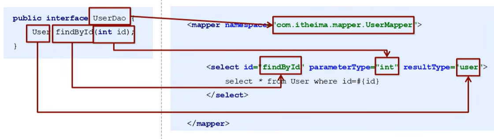

## `MyBatis`的`Dao`层实现

之前的内容使用的`MyBatis`，都是以单元测试的方式实现的，但是后续的项目开发中，`MyBatis`代码一般要写到对应的`Dao`层中

### 传统开发方式

在`Dao`层编写`UserMapper`接口

```java
package com.jlc.dao;

import com.jlc.domain.User;
import java.util.List;

public interface UserMapper {
    List<User> findAll() throws IOException;
}
```

编写一个接口的类实现：

```java
package com.jlc.dao.impl;

import com.jlc.domain.User;
import com.jlc.dao.UserMapper;

public class UserMapperImpl implements UserMapper {
    public List<User> findAll() throws IOException {
        // 加载核心配置文件  
        InputStream resourceAsStream = Resources.getResourceAsStream("SqlMapConfig.xml"); 
        // 获得 sqlSession 工厂对象（会话工厂对象）  
        SqlSessionFactory sqlSessionFactory = new SqlSessionFactoryBuilder().build(resourceAsStream);  
        // 获得 sqlSession 对象  （通过工厂对象获得会话对象）
        SqlSession sqlSession = sqlSessionFactory.openSession(); 
     
        // 执行 SQL 语句    参数：namespace+id
        // 查询操作
        List<User> userList = sqlSession.selectList("userMapper.findAll");  
        return userList;
    }
}
```

编写对应业务层的内容：以单元测试的方法调用`MyBatis`的`Dao`层实现

```java
package com.jlc.service;

import com.jlc.domain.User;
import java.util.List;

public class ServiceDemo throws IOException {
    // 创建dao层对象，当前dao层的实现是手动编写的
    UserMapper userMapper = new UserMapperImpl();
    List<User> all = userMapper.findAll();
    System.out.println(all);
}
```

通过传统的方式实现`MyBatis`的`Dao`层实现是比较繁琐的

***

### 代理开发方式

`Mybatis `的代理开发方式实现`DAO`层的开发是企业中的主流方法。通过` Mapper` 接口开发，程序员只需编写 `Mapper `接口（相当于` Dao `接口），`Mybatis` 框架会根据接口定义创建动态代理对象，代理对象的方法体与` Dao` 接口实现类方法一致

`Mapper`接口开发规范：

1. `Mapper.xml` 映射文件中的 `namespace` 必须与 `Mapper` 接口的全限定名相同

   映射文件中的`namespace`为`UserMapper`， `Mapper` 接口的全限定名中的接口名也要为`UserMapper`

2. `Mapper` 接口的方法名必须与 `Mapper.xml `中定义的每个 `statement` 的 `id` 相同

   接口中具体的方法名和映射文件中的操作`id`要一致

3. `Mapper` 接口方法的输入参数类型必须与 `Mapper.xml` 中定义的每个 `SQL` 的 `parameterType` 类型相同

4. `Mapper` 接口方法的输出参数类型必须与 `Mapper.xml` 中定义的每个 `SQL` 的 `resultType` 类型相同



基本实现：

在`Dao`层编写`UserMapper`接口

```java
package com.jlc.dao;

import com.jlc.domain.User;
import java.util.List;

public interface UserMapper {
    List<User> findAll();
}
```

在映射文件`UserMapper.xml`文件中进行配置：

```xml
<?xml version="1.0" encoding="UTF-8"?>
<!DOCTYPE mapper PUBLIC "-//mybatis.org//DTD Mapper 3.0//EN" "http://mybatis.org/dtd/mybatis-3-mapper.dtd">

<!--具体的配置-->
<mapper namespace="com.jlc.dao.UserMapper">   
    <!--查询操作-->
    <select id="findAll" resultType="com.jlc.domain.User">  
    	select * from user
    </select>
</mapper>
```

在服务层进行调用：

```java
package com.jlc.service;

import com.jlc.domain.User;
import java.io.InputStream;
import java.util.List;

public class ServiceDemo throws IOException {
    // 加载核心配置文件  
    InputStream resourceAsStream = Resources.getResourceAsStream("SqlMapConfig.xml"); 
    // 获得 sqlSession 工厂对象（会话工厂对象）  
    SqlSessionFactory sqlSessionFactory = new SqlSessionFactoryBuilder().build(resourceAsStream);  
    // 获得 sqlSession 对象  （通过工厂对象获得会话对象）
    SqlSession sqlSession = sqlSessionFactory.openSession(); 

    // 通过代理自动配置
    UserMapper mapper = sqlSession.getMapper(UserMapper.class);
    List<User> all = mapper.findAll();
    System.out.println(all);
}
```

使用代理开发的方式，我们就不用进行接口的类实现，`MyBatis`会自动的帮助我们进行动态的代理实现