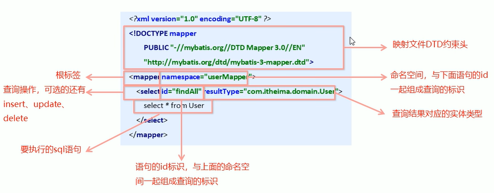

## 映射文件



> - `DTD`的约束头添加了后，后续配置时就有标签的提示

***

### 动态`sql`

在对于复杂业务逻辑时，我们需要`sql`是动态变化的

#### 动态`sql`的常用标签

##### `<if>`标签

我们根据实体类的不同取值，使用不同的`SQL`语句来进行查询，如在`id`如果不为空时可以根据`id`进行查询，如果`username`不同时为空，还要加入用户名作为查询条件，这种情况在我们的多条件组合查询中经常看到

使用演示：使用代理开发的方式进行`Dao`层内容的编写：

- 在`Dao`层编写`UserMapper`接口

  ```java
  package com.jlc.mapper;
  
  import com.jlc.domain.User;
  import java.util.List;
  
  public interface UserMapper {
      public List<User> findByCondition(User user);
  }
  ```

- 在映射文件`UserMapper.xml`文件中进行配置：

  ```xml
  <?xml version="1.0" encoding="UTF-8"?>
  <!DOCTYPE mapper PUBLIC "-//mybatis.org//DTD Mapper 3.0//EN" "http://mybatis.org/dtd/mybatis-3-mapper.dtd">
  
  <!--具体的配置-->
  <mapper namespace="com.jlc.mapper.UserMapper">   
      <!--根据动态条件查询-->
      <select id="findByCondition" parameterType="com.jlc.domain.User" resultType="com.jlc.domain.User">  
      	select * from user
          <where>    <!--如果三个条件都不满足，那么where标签也失效，相对于查询全部-->
              <if test="id!=0">
                  and id=#{id}
              </if>
              <if test="username!=null">
                  and username=#{username}
              </if>
              <if test="password!=null">
                  and password=#{password}
              </if>
          </where>
      </select>
  </mapper>
  ```

- 创建测试代码：

  ```java
  package com.jlc.test;
  
  import org.junit.Test;
  import com.jlc.domain.User;
  import java.io.InputStream;
  import java.util.List;
  
  public class MapperTest throws IOException {
      @Test
      public void test() {
          // 加载核心配置文件  
          InputStream resourceAsStream = Resources.getResourceAsStream("SqlMapConfig.xml"); 
          // 获得 sqlSession 工厂对象（会话工厂对象）  
          SqlSessionFactory sqlSessionFactory = new SqlSessionFactoryBuilder().build(resourceAsStream);  
          // 获得 sqlSession 对象  （通过工厂对象获得会话对象）
          SqlSession sqlSession = sqlSessionFactory.openSession(); 
  
          UserMapper mapper = sqlSession.getMapper(UserMapper.class);
  	
          // 模拟条件user
          User condition = new User();
          condition.setId(1);
          condition.setUsername("jlc");
          condition.setPassword("123");   // 少一个条件，也可以查询到对应的数据
          
          List<User> userList = mapper.findByCondition(condition);
          System.out.println(userList);
      }
  }
  ```

##### `<foreach>`标签

使用演示：使用代理开发的方式进行`Dao`层内容的编写：

- 在`Dao`层编写`UserMapper`接口

  ```java
  package com.jlc.mapper;
  
  import com.jlc.domain.User;
  import java.util.List;
  
  public interface UserMapper {
      public List<User> findByIds(List<Integer> ids);
  }
  ```

- 在映射文件`UserMapper.xml`文件中进行配置：

  ```xml
  <?xml version="1.0" encoding="UTF-8"?>
  <!DOCTYPE mapper PUBLIC "-//mybatis.org//DTD Mapper 3.0//EN" "http://mybatis.org/dtd/mybatis-3-mapper.dtd">
  
  <!--具体的配置-->
  <mapper namespace="com.jlc.mapper.UserMapper">   
      <!--根据动态条件查询-->
      <select id="findByIds" parameterType="list" resultType="com.jlc.domain.User">  
      	select * from user
          <where>
              <foreach collection="list" open="id in(" close=")" item="id" separator=",">
              	#{id}
              </foreach>
          </where>
      </select>
  </mapper>
  ```

  > 传统情况下根据多`id`查询的`sql`语句为`select * from user where id in(1,2,3)`
  >
  > - `collection`：表示传递过来数据的类型，可以是集合`lsit`，也可以是数组`array`
  > - `open`：  表示查询开始的前缀
  > - `close`：表示查询结束的后缀
  > - `item`：用于接收传入集合或数组中的每一项，命名随意，但是使用时要对应`#{id}`
  > - `separator`：指定分割符

- 创建测试代码：

  ```java
  package com.jlc.test;
  
  import org.junit.Test;
  import com.jlc.domain.User;
  import java.io.InputStream;
  import java.util.List;
  
  public class MapperTest throws IOException {
      @Test
      public void test() {
          // 加载核心配置文件  
          InputStream resourceAsStream = Resources.getResourceAsStream("SqlMapConfig.xml"); 
          // 获得 sqlSession 工厂对象（会话工厂对象）  
          SqlSessionFactory sqlSessionFactory = new SqlSessionFactoryBuilder().build(resourceAsStream);  
          // 获得 sqlSession 对象  （通过工厂对象获得会话对象）
          SqlSession sqlSession = sqlSessionFactory.openSession(); 
  
          UserMapper mapper = sqlSession.getMapper(UserMapper.class);
  	
          // 模拟ids数据
          List<Integer> ids = new ArrayList<Integer>();
          ids.add(1);
          ids.add(2);
          
          List<User> userList = mapper.findByIds(ids);
          System.out.println(userList);
      }
  }
  ```

***

### `sql`片段的抽取

`SQL`中可以将重复的`sql`提取出来，使用时用`include`引用即可，最终达到`sql`复用的目的

```xml
<!--抽取sql片段简化编写-->
<sql id="selectUser" select * from User></sql>
<select id="findById" parameterType="int" resultType="com.jlc.domain.User">  
    <include refid="selectUser"></include> where id=#{id}
</select>
```

