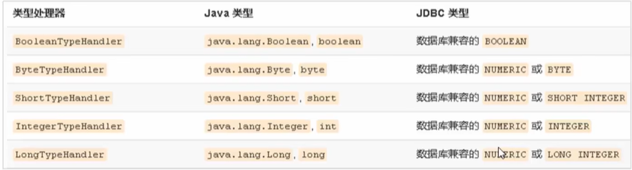

## 核心配置文件

编写核心文件`SqlMapConfig.xml`用于`MyBatis `框架的核心配置

设置核心配置文件首先需要引入约束：

```xml
<?xml version="1.0" encoding="UTF-8"?>
<!DOCTYPE configuration PUBLIC "-//mybatis.org//DTD Config 3.0//EN" "http://mybatis.org/dtd/mybatis-3-config.dtd">
```

`MyBatis `核心配置文件的配置内容需要使用`<configuration>`根标签进行包裹：

```xml
<configuration>
	...
</configuration>
```

> 根标签包含如下的子标签：
>
> - `environments`：配置数据源环境信息，支持多环境的配置（即可以包括多个`<environment>`标签）
>
>   - `environment`：环境变量
>     - `transactionManager`：事务管理器，其`type`属性具体的取值有两个：
>       - `JDBC`：这个配置就是直接使用了`JDBC`的提交和回滚设置，它依赖于从数据源得到的连接来管理事务事务作用域。
>       - `MANAGED`：（该值使用的不多）这个配置几乎没有做什么，它从来不提交或回滚一个连接，而让容器来管理事务的整个生命周期（比如`JEE`应用服务器的上下文）。默认情况下它会关闭连接，然而一些容器并不希望这样，因此需要将`closeConnection`属性设置成`false`来阻止它默认的关闭行为
>     - `dataSource`：数据源配置，其`type`属性具体的取值有三个：
>       - `UNPOOLED`：这个数据源的实现只是每次被请求时打开和关闭连接
>       - `POOLED`：这种数据源的实现利用“池”的概念（连接池）将`JDBC`连接对象组织起来
>       - `JNDI`：这个数据源的实现是为了能在如`EJB`或应用服务器这类容器中使用，容器可以集中或在外部配置数据源，然后放置一个`JNDI`上下文的引用
>
>   ```xml
>   <!--配置当前数据源的环境-->
>   <environments default="development">   <!--default表示默认的环境名称，是内部某个id-->
>       <!--可以配置很多的数据库环境-->
>       <environment id="development">  <!--id指定当前环境的名称-->
>           <transactionManager type="JDBC" />   <!--指定事务类型是JDBC-->
>           <dataSource type="POOLED">    <!--指定当前数据源类型是连接池-->
>               <!--数据源配置的基本参数-->
>               <property name="driver" value="com.mysql.jdbc.Driver"/>
>               <property name="url" value="jdbc:mysql://localhost:3306/test"/>
>               <property name="username" value="root"/>
>               <property name="password" value="admin"/>
>           </dataSource>
>       </environment>
>   </environments>
>   ```
>
> - `properties`：配置属性
>
>   在实际开发中，通常将数据源的配置信息单独抽取成一个`properties`文件，该标签可以加载额外的`properties`文件
>
>   ```xml
>   <!--加载外部的.properties文件-->
>   <properties resource="jdbc.properties"></properties>
>   
>   <environments default="development">
>       <environment id="development">
>           <transactionManager type="JDBC" />
>           <dataSource type="POOLED">
>               <property name="driver" value="${jdbc.driver}"/>
>               <property name="url" value="${jdbc.url}"/>
>               <property name="username" value="${jdbc.username}"/>
>               <property name="password" value="${jdbc.password}"/>
>           </dataSource>
>       </environment>
>   </environments>
>   ```
>
>   编写数据库的配置文件：
>
>   ```properties
>   jdbc.driver=com.mysql.jdbc.Driver
>   jdbc.url=jdbc:mysql://localhost:3306/test
>   jdbc.username=root
>   jdbc.password=admin
>   ```
>
> - `setting`：设置参数
>
> - `typeAliases`：设置类型别名，为`Java`类型设置一个短的名字
>
>   配置`typeAliases`，为`com.jlc.domain.User`定义别名为`user`
>
>   ```xml
>   <typeAliases>
>       <typeAlias type="com.jlc.domain.User" alias="user"></typeAlias>
>   </typeAliases>
>   ```
>
>   对于自定义别名的配置，`MyBatis`框架已经为我们配置好了一些常用的类型别名：
>
>   |   别名    | 数据类型  |
>   | :-------: | :-------: |
>   | `string`  | `String`  |
>   |  `long`   |  `Long`   |
>   |   `int`   | `Integer` |
>   | `double`  | `Double`  |
>   | `boolean` | `Boolean` |
>
> - `typeHandlers`：类型处理器
>
> - `objectFactory`：对象工厂
>
> - `plugins`：插件
>
> - `databaseldProvider`：数据库厂商标识
>
> - `mappers`：配置映射器，加载映射文件，加载方式有如下几种：
>
>   - 使用相对于类路径来对的资源引用（常用方式）
>
>     例如：`<mapper resource="org/mybatis/builder/AuthorMapper.xml"/>`
>
>   - 使用完全限定资源定位符（`URL`）
>
>     例如：`<mapper url="file:///var/mappers/AuthorMapper.xml"/>`
>
>   - 使用映射器接口实现类的完全限定类名
>
>     例如：`<mapper class="org.mybatis.builder.AuthorMapper"/>`
>
>   - 将包内的映射器接口实现全部注册为映射器
>
>     例如：`<package name="org.mybatis.builder"/>`
>
>   ```xml
>   <!--加载映射文件-->
>   <mappers>
>       <mapper resource="com/jlc/mapper/UserMapper.xml"></mapper>
>   </mappers>
>   ```
>
> 对于`<configuration>`根标签的子标签的使用，必须要严格按照顺序进行使用，否则会报错，其顺序由前到后依次为：`properties`、`setting`、`typeAliases`、`typeHandlers`、`objectFactory`、`plugins`、`environments`、`databaseldProvider`、`mappers`

***

### 其他配置标签

#### `<typeHandlers>`

`<typeHandlers>`标签主要是用于类型重叠器的定义，无论是`MyBatis`在预处理语句（`PreparedStatement`）中设置一个参数时，还是从结果集中取出一个值时，都会用类型处理器将获取的值以合适的方式转换成`Java`类型，下表描述了一些默认的类型处理器：



我们也可以重写类型处理器或创建自己的类型处理器来处理不支持的或非标准的类型。具体做法为：实现`org.apache.ibatis.type.TypeHandler`接口，或继承一个便利的类`org.apache.ibatis.type.BaseTypeHandler`，然后可以选择性的将它映射到一个`JDBC`类型

需求：一个`Java`中的`Date`数据类型，我希望将其存储到数据库的时候存成一个1970年至今的毫秒数，取出来时又转换为`Java`的`Date`类型，即`Java`的`Date`与数据库的`varchar`毫秒值进行转换

开发步骤：

1. 定义转换类继承类`BaseTypeHandler<T>`    泛型`T`就是我们要转换的`Java`类型

2. 覆盖4个未实现的方法，其中`setNonNullParameter`为`Java`程序设置数据到数据库的回调方法（将`Java`类型的数据转换为数据库需要的类型数据），`getNullableResult`为查询时`mysql`的字符串类型转换成`Java`的`Type`类型的回调方法（`MyBatis`执行时，会自动的帮助我们执行这些回调方法）

   ```java
   package com.jlc.handler;
   
   import org.apache.ibatis.type.BaseTypeHandler;
   import java.util.Date;
   
   public class DateTypeHandler extends BaseTypeHandler<Date> {
       // 将Java类型转换成数据库需要的类型
       public void setNonNullParameter(PreparedStatement preparedStatement, int i, Date date, JdbcType jdbcType) {
           long time = date.getTime();  // 获取时间的毫秒值
           preparedStatement.setLong(i, time);   // 设置参数 i表示当前的参数位置
       }
       
       // 将数据库中的类型转换成Java类型  MyBatis底层会随机进行调用
       // String参数表示要转换的字段名称；ResultSet表示查询出的结果集
       public Date getNullableResult(ResultSet resultSet, String s) throws SQLException {
           // 获得结果集中需要的数据（long）转换成Date类型进行返回
           long aLong = resultSet.getLong(s);
           Date date = new Date(aLong);
           return date;
       }
       // 将数据库中的类型转换成Java类型  MyBatis底层会随机进行调用
       // int参数表示字段的位置；ResultSet表示查询出的结果集
       public Date getNullableResult(ResultSet resultSet, int i) throws SQLException {
           long aLong = resultSet.getLong(i);
           Date date = new Date(aLong);
           return date;
       }
       // 将数据库中的类型转换成Java类型  MyBatis底层会随机进行调用
       public Date getNullableResult(CallableStatement callableStatement, int i) throws SQLException {
           long aLong = callableStatement.getLong(i);
           Date date = new Date(aLong);
           return date;
       }
   }
   ```

3. 在`MyBatis`核心配置文件中进行注册

   ```xml
   <!--注册类型处理器-->
   <typeHandlers>
       <typeHandler handler="com.jlc.handler.DateTypeHandler"></typeHandler>
   </typeHandlers>
   ```

#### `<plugins>`

`MyBatis`可以使用第三方的插件来对功能进行拓展，以分页助手`PageHelper`为例，其插件是将分页的复杂操作进行封装，使用简单的方式即可获得分页的相关数据（分页助手一般是将全部查询的数据进行以分页的方式返回）

开发步骤：

1. 在`pom.xml`导入通用`PageHelper`的坐标

   ```xml
   <!--分页助手插件-->
   <dependency>
       <groupId>com.github.pagehelper</groupId>
       <artifactId>pagehelper</artifactId>
       <version>3.7.5</version>
   </dependency>
   <dependency>  <!--导入相关的解析器-->
       <groupId>com.github.jsqlparser</groupId>
       <artifactId>jsqlparser</artifactId>
       <version>0.9.1</version>
   </dependency>
   ```

2. 在`MyBatis`核心配置文件中配置`PageHelper`插件

   ```xml
   <!--配置插件时，必须要配置的mapper标签之前-->
   <plugins>
       <plugin interceptor="com.github.pagehelper">
           <!--指定方言-->
           <property name="dialect" value="mysql" />
       </plugin>
   </plugins>
   ```

3. 测试分页数据获取

   ```java
   public void test() throws IOException {
       // 加载核心配置文件  
       InputStream resourceAsStream = Resources.getResourceAsStream("SqlMapConfig.xml"); 
       // 获得 sqlSession 工厂对象（会话工厂对象）  
       SqlSessionFactory sqlSessionFactory = new SqlSessionFactoryBuilder().build(resourceAsStream);  
       // 获得 sqlSession 对象  （通过工厂对象获得会话对象）
       SqlSession sqlSession = sqlSessionFactory.openSession(); 
   
       // 设置分页的相关参数
       // 设置当前页和每页显式的条数
       PageHelper.startPage(1, 3);  // 当前为第一页，，每页显式三条数据
       
       // 查询全部
       UserMapper mapper = sqlSession.getMapper(UserMapper.class);
       List<User> userList = userMapper.findAll();
       for (User user : userList) {
           System.out.println(user);
       }
       
       // 获得与分页相关的参数
       PageInfo<User> pageInfo = new PageInfo<User>(userList);
       System.out.println("当前页:", pageInfo.getPageNum());
       System.out.println("每页显式条数:", pageInfo.getPageSize());
       System.out.println("总条数:", pageInfo.getTotal());
       System.out.println("总页数:", pageInfo.getPages());
       System.out.println("上一页:", pageInfo.getPrePage());
       System.out.println("下一页:", pageInfo.getNextPage());
       System.out.println("是否是第一个:", pageInfo.isIsFirstPage());
       System.out.println("是否是最后一个:", pageInfo.isIsLastPage());
   }
   ```

   