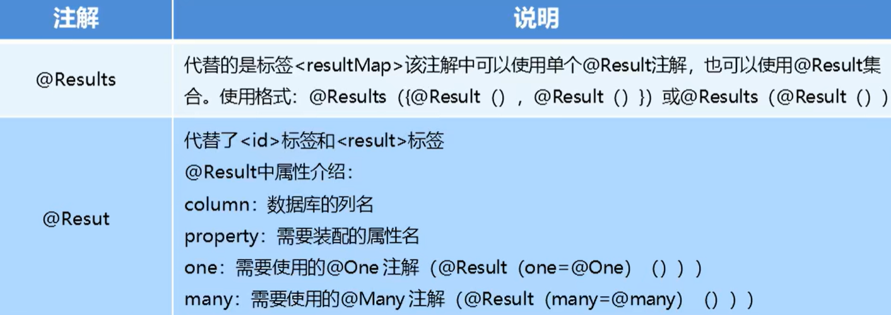
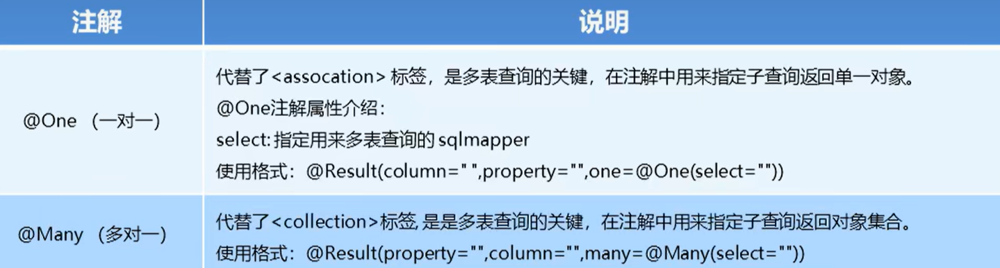
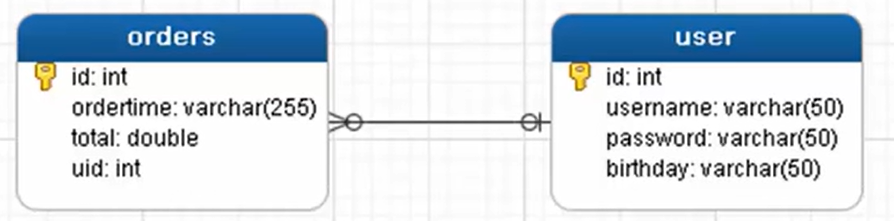
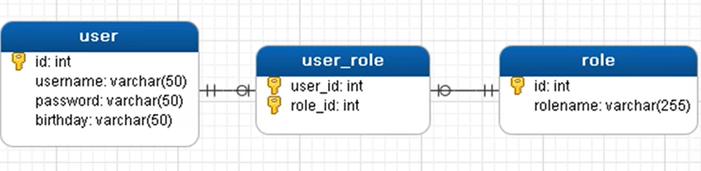

## 注解开发

`Mybatis`也是可以使用注解的开发方式，这样我们就可以减少编写`Mapper`映射文件

`Mybatis`中常见的注解有：

- `@Insert`：实现新增
- `@Update`：实现更新
- `@Delete`：实现删除
- `@Select`：实现查询
- `@Result`：实现结果集封装
- `@Results`：可以与`@Result`一起使用，封装多个结果集
- `@One`：实现一对一结果集封装
- `@Many`：实现一对多结果集封装

***

### 简单的增删改查

使用注解完成简单的增删改查操作

基本步骤：使用注解形式是不需要编写`UserMapper.xml`文件的（使用注解的方式进行替代）

1. 在导入相关坐标和创建相关数据库配置文件和`MyBatis`核心配置文件的基础上

   核心配置文件需要声明注解的使用：

   ```xml
   <?xml version="1.0" encoding="UTF-8"?>
   <!DOCTYPE configuration PUBLIC "-//mybatis.org//DTD Config 3.0//EN" "http://mybatis.org/dtd/mybatis-3-config.dtd">
   
   <configuration>
   	<!--配置当前数据源的环境-->
       <environments default="development">   <!--default表示使用具体的数据库环境-->
           <!--可以配置很多的数据库环境-->
           <environment id="development">
               <transactionManager type="JDBC"></transactionManager>
               <dataSource type="POOLED">
               	<property name="driver" value="com.mysql.jdbc.Driver"/>
                   <property name="url" value="jdbc:mysql://localhost:3306/test/"/>
                   <property name="username" value="root"/>
                   <property name="password" value="admin"/>
               </dataSource>
           </environment>
       </environments>
       
       <!--加载映射关系-->
       <mappers>
           <!--指定对应接口所在的包，进行自动扫描-->
           <package name="com.jlc.mapper"></package>
       </mappers>
   </configuration>
   ```

2. 创建`User`实体和对应的`UserMapper`接口

   ```java
   package com.jlc.domain;
   
   import java.util.Date;
   
   public class User {
       private int id;
       private String username;
       private String password;
       private Date birthday;
       
       public int getId() { return id; }
       public void setId(int id) { this.id = id; }
       
       public String getUsername() { return username; }
       public void setUsername(String username) { this.username = username; }
       
       public String getPassword() { return password; }
       public void setPassword(String password) { this.password = password; }
       
       public Date getBirthday() { return birthday; }
       public void setBirthday(Date birthday) { this.birthday = birthday; }
   }
   ```

   ```java
   package com.jlc.mapper;
   
   import com.jlc.domain.User;
   import java.util.List;
   
   // 在接口中配置相应方法的注解，注解中编写相应的SQL语句
   public interface UserMapper {
       @Insert("insert into user values(#{id}, #{username}, #{password})")
   	public void save(User user);
       
       @Update("update user set username=#{username}, password=#{password} where id=#{id}")
       public void update(User user);
       
       @Delete("delete from user where id=#{id}")
       public void delete(int id);
       
       @Select("select * from user where id=#{id}")
       public User findById(int id);
       
       @Select("select * from user")
       public List<User> findAll(); 
   }
   ```

3. 创建测试文件

   ```java
   package com.jlc.test;
   
   import com.jlc.domain.User;
   import java.util.List;
   
   public class MyBatisTest {
       private UserMapper mapper;
       // 抽取公用的代码
       @Before
       public void before() throw IOException {
           // 加载核心配置文件  
           InputStream resourceAsStream = Resources.getResourceAsStream("SqlMapConfig.xml"); 
           // 获得 sqlSession 工厂对象（会话工厂对象）  
           SqlSessionFactory sqlSessionFactory = new SqlSessionFactoryBuilder().build(resourceAsStream);  
           // 获得 sqlSession 对象  （通过工厂对象获得会话对象）  并设置事务自动提交
           SqlSession sqlSession = sqlSessionFactory.openSession(true); 
           mapper = sqlSession.getMapper(UserMapper.class);
       }
       
       // 具体的测试方法
       @Test
       public void testSave() {
           User user = new User();
           user.setUsername("jlc");
           user.setPassword("abc");
           mapper.save(user);
       }
       
       @Test
       public void testDelete() {
           mapper.delete(1);
       }
       
       @Test
       public void testFindById() {
           User user = mapper.findById(2);
           System.out.println(user);
       }
       
       @Test
       public void testFindAll() {
           List<User> all = mapper.findAll();
           for (User user : all) {
               System.out.println(user);
           }
       }
   }
   ```

***

### 复杂查询的实现

实现复杂查询之前是在映射文件中通过配置`<resultMap>`来 实现，在使用注解开发后，我们可以使用`@Results`注解，`@Result`注解、`@One`注解、`@Many`注解组合完成复杂关系的配置





#### 一对一查询

如用户表和订单表的关系就是一对一查询，一个用户可以有多个订单，一个订单只从属于一个用户

一对一查询的需求：查询一个订单，与此同时查询出该订单所属的用户



基本步骤：使用注解的方式

1. 创建实体类`Order`和`User`

   在`src/main/java`文件夹下创建：

   ```java
   package com.jlc.domain;
   
   import java.util.Date;
   
   public class User {
       private int id;
       private String username;
       private String password;
       private Date birthday;
       
       public int getId() { return id; }
       public void setId(int id) { this.id = id; }
       
       public String getUsername() { return username; }
       public void setUsername(String username) { this.username = username; }
       
       public String getPassword() { return password; }
       public void setPassword(String password) { this.password = password; }
       
       public Date getBirthday() { return birthday; }
       public void setBirthday(Date birthday) { this.birthday = birthday; }
   }
   ```

   ```java
   package com.jlc.domain;
   
   import java.util.Date;
   
   public class Order {
       private int id;
       private Date ordertime;
       private double total;
       // 当前订单属于哪一个用户
       private User user;
       
       public int getId() { return id; }
       public void setId(int id) { this.id = id; }
       
       public Date getOrdertime() { return ordertime; }
       public void setOrdertime(Date ordertime) { this.ordertime = ordertime; }
       
       public double getTotal() { return total; }
       public void setTotal(double total) { this.total = total; }
   }
   ```

2. 创建对应的接口

   编写`OrderMapper`接口

   ```java
   package com.jlc.mapper;
   
   import com.jlc.domain.Order;
   import java.util.List;
   
   public interface OrderMapper {
       @Select("select *, o.id oid FROM orders o, user u WHERE o.uid = u.id")
       @Results({
           @Result(column = "oid", property = "id"),
           @Result(column = "ordertime", property = "ordertime"),
           @Result(column = "total", property = "total"),
           @Result(column = "uid", property = "user.id"),
           @Result(column = "username", property = "user.username"),
           @Result(column = "password", property = "user.password")
       })
       public List<Order> findAll();
   }
   ```

   > 上述方式是两张表一起进行查询，也可以使用分表进行查询（使用的多），使用如下的方式进行替换：
   >
   > ```java
   > @Select("select * FROM orders")
   > @Results({
   >  @Result(column = "id", property = "id"),
   >  @Result(column = "ordertime", property = "ordertime"),
   >  @Result(column = "total", property = "total"),
   >  @Result(
   >      property = "user",   // 要封装的属性名称
   >      column = "uid",   // 根据哪个字段去查询user表的数据
   >  	javaType = User.class,   // 要封装的实体类型
   >      // select属性，代表查询哪个接口的方法获得数据
   >      one = @One(select = "com.jlc.mapper.UserMapper.findById")
   >  )
   > })
   > ```
   >
   > ```java
   > package com.jlc.mapper;
   > 
   > import com.jlc.domain.User;
   > import java.util.List;
   > 
   > // 在接口中配置相应方法的注解，注解中编写相应的SQL语句
   > public interface UserMapper {
   >  @Select("select * from user where id=#{id}")
   >  public User findById(int id);
   > }
   > ```

3. 在核心配置文件`sqlMapConfig.xml`中配置映射关系

   ```xml
   <!--加载映射关系-->
   <mappers>
       <!--指定对应接口所在的包，进行自动扫描-->
       <package name="com.jlc.mapper"></package>
   </mappers>
   ```

4. 测试代码

   ```java
   package com.jlc.test;
   
   import com.jlc.domain.Order;
   import java.util.List;
   
   public class MyBatisTest {
       private OrderMapper mapper;
       // 抽取公用的代码
       @Before
       public void before() throw IOException {
           // 加载核心配置文件  
           InputStream resourceAsStream = Resources.getResourceAsStream("SqlMapConfig.xml"); 
           // 获得 sqlSession 工厂对象（会话工厂对象）  
           SqlSessionFactory sqlSessionFactory = new SqlSessionFactoryBuilder().build(resourceAsStream);  
           // 获得 sqlSession 对象  （通过工厂对象获得会话对象）  并设置事务自动提交
           SqlSession sqlSession = sqlSessionFactory.openSession(true); 
           mapper = sqlSession.getMapper(OrderMapper.class);
       }
       
       // 一对一查询的测试方法
       @Test
       public void test() {
           List<Order> all = mapper.findAll();
           for (Order order : all) {
               System.out.println(order);
           }
       }
   }
   ```

#### 一对多查询

用户表和订单表的关系为：一个用户有多个订单，一个订单只从属于一个用户

一对多查询的需求：查询一个用户，与此同时查询出该用户具有的所有订单

基本步骤：使用注解进行配置

1. 创建实体类`Order`和`User`

   在`src/main/java`文件夹下创建：

   ```java
   package com.jlc.domain;
   
   import java.util.Date;
   import java.util.List;
   
   public class User {
       private int id;
       private String username;
       private String password;
       private Date birthday;
       
       // 描述当前用户下存在哪些订单
       private List<Order> orderList;
       
       public int getId() { return id; }
       public void setId(int id) { this.id = id; }
       
       public String getUsername() { return username; }
       public void setUsername(String username) { this.username = username; }
       
       public String getPassword() { return password; }
       public void setPassword(String password) { this.password = password; }
       
       public Date getBirthday() { return birthday; }
       public void setBirthday(Date birthday) { this.birthday = birthday; }
       
       public List<Order> getOrderList() { return orderList; }
       public void setOrderList(List<Order> orderList) { this.orderList = orderList; }
   }
   ```

   ```java
   package com.jlc.domain;
   
   import java.util.Date;
   
   public class Order {
       private int id;
       private Date ordertime;
       private double total;
       
       public int getId() { return id; }
       public void setId(int id) { this.id = id; }
       
       public Date getOrdertime() { return ordertime; }
       public void setOrdertime(Date ordertime) { this.ordertime = ordertime; }
       
       public double getTotal() { return total; }
       public void setTotal(double total) { this.total = total; }
   }
   ```

2. 创建对应的接口

   在`mapper`层编写`UserMapper`接口

   ```java
   package com.jlc.mapper;
   
   import com.jlc.domain.User;
   import java.util.List;
   
   public interface UserMapper {
       @Select("select * from user")
       @Results({
           @Result(id=true, column = "id", property = "id"),  // 表明id是一个主键
           @Result(column = "username", property = "username"), 
           @Result(column = "password", property = "password"), 
           @Result(
               property = "orderList",   // 要封装的属性名称
               column = "id",   // 根据哪个字段去查询user表的数据
               javaType = List.class,   // 要封装的实体类型
               // select属性，代表查询哪个接口的方法获得数据
               many = @Many(select = "com.jlc.mapper.OrderMapper.findByUid")
           )
       })
   	public List<User> findUserAndOrderAll();
   }
   ```

   编写`OrderMapper`接口

   ```java
   package com.jlc.mapper;
   
   import java.util.List;
   
   public interface OrderMapper {
       // 根据uid查找
       @Select("select * from orders where uid=#{uid}")
       public List<Order> findByUid(int uid);
   }
   ```

3. 在核心配置文件`sqlMapConfig.xml`中配置映射关系

   ```xml
   <!--加载映射关系-->
   <mappers>
       <!--指定对应接口所在的包，进行自动扫描-->
       <package name="com.jlc.mapper"></package>
   </mappers>
   ```

4. 测试代码

   ```java
   package com.jlc.test;
   
   import com.jlc.domain.Order;
   import java.util.List;
   
   public class MyBatisTest {
       private UserMapper mapper;
       // 抽取公用的代码
       @Before
       public void before() throw IOException {
           // 加载核心配置文件  
           InputStream resourceAsStream = Resources.getResourceAsStream("SqlMapConfig.xml"); 
           // 获得 sqlSession 工厂对象（会话工厂对象）  
           SqlSessionFactory sqlSessionFactory = new SqlSessionFactoryBuilder().build(resourceAsStream);  
           // 获得 sqlSession 对象  （通过工厂对象获得会话对象）  并设置事务自动提交
           SqlSession sqlSession = sqlSessionFactory.openSession(true); 
           mapper = sqlSession.getMapper(UserMapper.class);
       }
       
       // 一对多查询的测试方法
       @Test
       public void test() {
           List<Order> userAndOrderAll = mapper.findUserAndOrderAll();
           for (User user : userAndOrderAll) {
               System.out.println(user);
           }
       }
   }
   ```

#### 多对多查询

用户表和角色表的关系为：一个用户有多个角色，一个角色可以被多个用户使用

多对多查询的需求：查询用户同时查询该用户的所有角色（多对多的建表原则是要引入一张中间表，来维护两个外键）



基本步骤：使用注解进行配置

1. 创建实体类`User`和`Role`

   在`src/main/java`文件夹下创建：

   ```java
   package com.jlc.domain;
   
   import java.util.Date;
   import java.util.List;
   
   public class User {
       private int id;
       private String username;
       private String password;
       private Date birthday;
       
       // 描述当前用户具备哪些角色
       private List<Role> roleList;
       
       public int getId() { return id; }
       public void setId(int id) { this.id = id; }
       
       public String getUsername() { return username; }
       public void setUsername(String username) { this.username = username; }
       
       public String getPassword() { return password; }
       public void setPassword(String password) { this.password = password; }
       
       public Date getBirthday() { return birthday; }
       public void setBirthday(Date birthday) { this.birthday = birthday; }
       
       public List<Role> getRoleList() { return roleList; }
   }
   ```

   ```java
   package com.jlc.domain;
   
   public class Role {
       private int id;
       private String roleName;
       private String roleDesc;
       
       public int getId() { return id; }
       public void setId(int id) { this.id = id; }
       
       public String getRoleName() { return roleName; }
       public void setRoleName(String roleName) { this.roleName = roleName; }
       
       public String getRoleDesc() { return roleDesc; }
       public void setRoleDesc(String roleDesc) { this.roleDesc = roleDesc; }
   }
   ```

2. 创建对应的接口

   在`mapper`层编写`UserMapper`接口

   ```java
   package com.jlc.mapper;
   
   import com.jlc.domain.User;
   import java.util.List;
   
   public interface UserMapper {
       @Select("select * From user")
       @Results({
           @Result(id=true, column = "id", property = "id"),  // 表明id是一个主键
           @Result(column = "username", property = "username"), 
           @Result(column = "password", property = "password"), 
           @Result(
               property = "roleList",   // 要封装的属性名称
               column = "id",   // 根据哪个字段的结果去查询user表的数据
               javaType = List.class,   // 要封装的实体类型
               // select属性，代表查询哪个接口的方法获得数据
               many = @Many(select = "com.jlc.mapper.RoleMapper.findByUid")
           )
       })
   	public List<User> findUserAndRoleAll();
   }
   ```

   创建`RoleMapper`接口

   ```java
   package com.jlc.mapper;
   
   import com.jlc.domain.Role;
   import java.util.List;
   
   public interface RoleMapper {
       @Select("select * FROM sys_user_role ur, sys_role r WHERE ur.roleId=r.id AND ur.userId=#{uid}")
       public List<Role> findByUid(int uid);
   }
   ```

   多对多查询和一对多查询的唯一区别就是`SQL	`语句编写的不同（多对多额外有一张中间表）

3. 在核心配置文件`sqlMapConfig.xml`中配置映射关系

   ```xml
   <!--加载映射关系-->
   <mappers>
       <!--指定对应接口所在的包，进行自动扫描-->
       <package name="com.jlc.mapper"></package>
   </mappers>
   ```

4. 测试代码

   ```java
   package com.jlc.test;
   
   import com.jlc.domain.Order;
   import java.util.List;
   
   public class MyBatisTest {
       private UserMapper mapper;
       // 抽取公用的代码
       @Before
       public void before() throw IOException {
           // 加载核心配置文件  
           InputStream resourceAsStream = Resources.getResourceAsStream("SqlMapConfig.xml"); 
           // 获得 sqlSession 工厂对象（会话工厂对象）  
           SqlSessionFactory sqlSessionFactory = new SqlSessionFactoryBuilder().build(resourceAsStream);  
           // 获得 sqlSession 对象  （通过工厂对象获得会话对象）  并设置事务自动提交
           SqlSession sqlSession = sqlSessionFactory.openSession(true); 
           mapper = sqlSession.getMapper(UserMapper.class);
       }
       
       // 多对多查询的测试方法
       @Test
       public void test() {
           List<Order> userAndRoleAll = mapper.findUserAndRoleAll();
           for (User user : userAndRoleAll) {
               System.out.println(user);
           }
       }
   }
   ```


