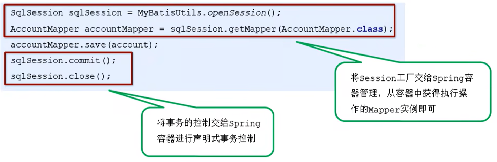

## `MyBatis`整合`Spring`实现

对于上述的原始方式整合`SSM`框架，在业务层代码中存在一些弊端，常见的弊端有：

- 每次加载业务方法时都会加载一次`sqlMapConfig.xml`配置文件，也都会创建一次工厂，最终执行完毕，都会进行一次事务提交，我们可以根据`Spring`的方式进行依赖的注入

业务层编写`Service`接口实现类代码如下：

```java
package com.jlc.service.impl;

import com.jlc.domain.Account;
import com.jlc.service.AccountService;
import java.util.List;

@Service("accountService")
public class AccountServiceImpl implements AccountService {
    @Override
    public void save(Account account) {
        try {
            InputStream resourceAsStream = Resources.getResourceAsStream("sqlMapConfig.xml");
            SqlSessionFactory sqlSessionFactory = new SqlSessionFactoryBuilder().build(resourceAsStream);
            SqlSession sqlSession = sqlSessionFactory.openSession();
            AccountMapper accountMapper = sqlSession.getMapper(AccountMapper.class);
            accountMapper.save(account);
            sqlSession.commit();
            sqlSession.close();
        } catch (IOException e) {
            e.printStackTrace();
        }
    }
	
    @Override
    public List<Account> findAll() {
        try {
            InputStream resourceAsStream = Resources.getResourceAsStream("sqlMapConfig.xml");
            SqlSessionFactory sqlSessionFactory = new SqlSessionFactoryBuilder().build(resourceAsStream);
            SqlSession sqlSession = sqlSessionFactory.openSession();
            AccountMapper accountMapper = sqlSession.getMapper(AccountMapper.class);
            List<Account> accountList = mapper.findAll();
            sqlSession.close();
            return accountList;
        } catch (IOException e) {
            e.printStackTrace();
        }
    }
}
```

整合思路：



- 将`SqlSessionFactory`配置到`Spring`容器中（将`SqlSessionFactory`工厂的创建权交给`Spring`）

- 配置事务控制（将事务控制权交给`Spring`容器进行声明式事务控制）

  将部分配置在`sqlMapConfig.xml`配置文件中的部分信息转移到`Spring`的配置文件中，修改后的`Spring`配置文件和`sqlMapConfig.xml`文件如下：

  `Spring`配置文件：`applicationContext.xml`

  ```xml
  <?xml version="1.0" encoding="UTF-8"?>
  <beans xmlns="http://www.springframework.org/schema/beans"
  xmlns:xsi="http://www.w3.org/2001/XMLSchema-instance"
  xmlns:aop="http://www.springframework.org/schema/aop"
  xmlns:tx="http://www.springframework.org/schema/tx"
  xmlns:context="http://www.springframework.org/schema/context"
  xsi:schemaLocation="http://www.springframework.org/schema/beans
  http://www.springframework.org/schema/beans/spring-beans.xsd
  http://www.springframework.org/schema/tx
  http://www.springframework.org/schema/tx/spring-tx.xsd
  http://www.springframework.org/schema/aop
  http://www.springframework.org/schema/aop/spring-aop.xsd
  http://www.springframework.org/schema/context
  http://www.springframework.org/schema/context/spring-context.xsd">
      
  	<!-- 组件扫描 扫描service和mapper -->
      <context:component-scan base-package="com.jlc">
      	<!--排除对controller的扫描-->
          <context:exclude-filter type="annotation" expression="org.springframework.stereotype.Controller">
      </context:component-scan>
      
      <!--加载jdbc.properties-->
      <context:property-placeholder location="classpath:jdbc.properties"/>
      <!--配置数据源-->
      <bean id="dataSource" class="com.mchange.v2.c3p0.ComboPooledDataSource">
          <property name="driverClass" value="${jdbc.driver}"/>
          <property name="jdbcUrl" value="${jdbc.url}"/>
          <property name="user" value="${jdbc.username}"/>
          <property name="password" value="${jdbc.password}"/>
      </bean>
          
      <!--配置MyBatis的SqlSessionFactory-->  <!--mybatis-spring包中提供了工厂实现类-->
      <bean id="sqlSessionFactory" class="org.mybatis.spring.SqlSessionFactoryBean">
          <!--加载数据源信息和MyBatis配置信息-->
          <property name="dataSource" ref="dataSource"/>
          <property name="configLocation" value="classpath:sqlMapConfig.xml"/>
      </bean>
          
      <!--扫描mapper所在的包，为mapper创建实现类，等价于Mybatis配置中的加载映射-->
      <bean class="org.mybatis.spring.mapper.MapperScannerConfigurer">
          <property name="basePackage" value="com.jlc.mapper"></property>
      </bean>
          
      <!--声明式事务控制-->
      <!--配置平台事务管理器，适用于jdbc模板-->
      <bean id="transactionManager" class="org.springframework.jdbc.datasource.DataSourceTransactionManager">
          <property name="dataSource" ref="dataSource"/>
      </bean>
      <!--配置事务的增强-->
      <tx:advice id="txAdvice" transaction-manager="transactionManager">
          <!--设置事务的属性信息-->
          <tx:attributes>
              <tx:method name="*" />
          </tx:attributes>
      </tx:advice>
      <!--配置事务控制的织入-->
      <aop:config>
          <aop:advisor advice-ref="txAdvice" pointcut="execution(* com.jlc.service.impl.*.*(..))"></aop:advisor>    <!--任意方法都进行事务控制-->
      </aop:config>
  </beans>
  ```

  `MyBatis`核心文件：`sqlMapConfig.xml`

  ```xml
  <?xml version="1.0" encoding="UTF-8"?>
  <!DOCTYPE configuration PUBLIC "-//mybatis.org//DTD Config 3.0//EN" "http://mybatis.org/dtd/mybatis-3-config.dtd">
  
  <configuration>    
  	<!--定义别名-->
      <typeAliases>
          <!--方式一，一个一个的配置别名-->
          <typeAlias type="com.jlc.domain.Account" alias="account"></typeAlias>
          <!--方式二，通过扫包的方式进行别名的配置，包下所有的实体都使用实体类作为别名-->
          <package name="com.jlc.domain"></package>
      </typeAliases>
  </configuration>
  ```

修改业务层的逻辑代码：

```java
package com.jlc.service.impl;

import com.jlc.domain.Account;
import com.jlc.service.AccountService;
import java.util.List;

@Service("accountService")
public class AccountServiceImpl implements AccountService {
    @Autowired
    private AccountMapper accountMapper;
    
    @Override
    public void save(Account account) {
        accountMapper.save(account);
    }
	
    @Override
    public List<Account> findAll() {
        return accountMapper.findAll();
    }
}
```

