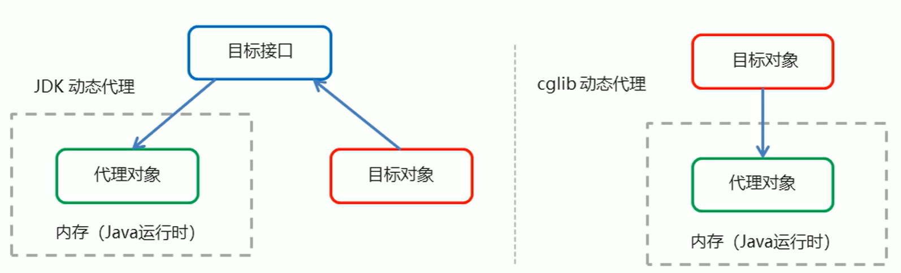

## `AOP`

`AOP`为`Aspect Oriented Programming`的首字母缩写，意思是面向切面编程，是通过预编译的方式和运行期动态代理（不修改源码的情况下，对目标方法进行相应的增强，完成了程序功能之间的松耦合）实现程序功能统一维护的一种技术（目标方法和功能增强方法结合到一起，这一部分被称为切面）

`AOP` 是 `OOP `（面向对象编程）的延续，是软件开发中的一个热点，也是`Spring`框架中的一个重要内容，是函数式编程的一种衍生范型。利用`AOP`可以对业务逻辑的各个部分进行隔离（解耦合），从而使业务逻辑各部分之间的耦合度降低，提高程序的可重用性，同时提高了开发的效率。

`AOP`的作用和优势：

- 作用：在程序运行期间，在不修改源码的情况下对方法进行功能的增强
- 优势：减少重复代码，提高开发效率，并且便于维护

`AOP`的相关术语有：

- `Target`：代理的目标对象

- `Proxy`：代理，一个类被`AOP`织入增强后，就产生了一个结果代理类

- `Joinpoint`：连接点，指的是那些被拦截到的点，在`spring`中，这些点指的是方法（可以被增强的方法，如10个目标对象的方法都可以被进行增强，那么这10个目标对象的方法都可以叫做连接点），因为`spring`只支持方法类型的连接点

- `Pointcut`：切入点，指的是我们要对哪些`Joinpoint`连接点进行拦截的定义（真正被增强的连接点）

  连接点的范围是大于切入点的

- `Advice`：通知/增强，指拦截到`Joinpoint`连接点之后要做的事情就是通知/增强（对目标方法进行增强的方法就是通知）

- `Aspect`：切面，是切入点和通知/增强的结合

- `Weaving`：织入，是指把增强应用到目标对象来创建新代理对象的过程，`Spring`采用动态代理织入，而`AspectJ`采用编译期织入和类装载期织入

`AOP`开发需要明确的事项：

1. 需要编写的内容
   - 编写核心业务代码（目标类的目标方法）
   - 编写切面类，切面类中有通知（增强功能方法）
   - 在配置文件中，配置织入关系，即将哪些通知与哪些连接点进行结合
2. `AOP`技术实现的内容
   - `Spring`框架监控切入点方法的执行，一旦监控到切入点方法被运行，使用代理机制，动态创建目标对象的代理对象，根据通知类别，在代理对象的对应位置，将通知对应的功能织入，完成完整代码逻辑的运行
3. `AOP`底层使用的代理方式
   - 在`Spring`中，框架会根据目标类是否实现了接口来决定采用哪种动态代理的方式

***

### 底层实现

实际上，`AOP`的底层实现是通过`Spring`提供的动态代理技术实现的。在运行期间，`Spring`通过动态代理技术动态的生成代理对象，代理对象方法执行时进行增强功能的介入，在去调用目标对象的方法，从而完成功能增强。

常用的动态代理技术有：`JDK`代理（基于接口的动态代理技术，对于没有接口的不适用）；`cglib`代理（基于父类的动态代理技术，于`JDK`代理进行互补）



> - `JDK`动态代理：对于目标对象的内部方法需要被增强，该目标对象必须有接口（目标接口有什么方法，目标对象就有什么方法），在运行期间，基于接口动态的生成一个代理对象，这就保证了代理对象和目标对象有相同的方法
>
>   底层实现：
>
>   先创建一个接口：
>
>   ```java
>   package com.jlc.proxy.jdk;
>   
>   public interface TargetInterface {
>       public void save();
>   }
>   ```
>
>   为这个接口给定一个实现：
>
>   ```java
>   package com.jlc.proxy.jdk;
>   
>   public class Target implements TargetInterface {
>       public void save() {
>           System.out.println("save running...");
>       }
>   }
>   ```
>
>   创建一个增强功能：
>
>   ```java
>   package com.jlc.proxy.jdk;
>   
>   public class Advice {
>       // 前置增强（在目标对象之前进行增强）
>       public void beforeReturning() {
>           System.out.println("前置增强...");
>       }
>       // 后置增强（在目标对象之后进行增强）
>       public void afterReturning() {
>           System.out.println("后置增强...");
>       }
>   }
>   ```
>
>   测试代码：
>
>   ```java
>   package com.jlc.proxy.jdk;
>   
>   public class ProxyTest {
>       public static void main(Stringp[] args) {
>           // 创建目标对象
>           final Target target = new Target();
>           // 增强对象
>           Advice advice = new Advice();
>   
>           // 返回值就是动态生成的代理对象
>           TargetInterface proxy = (TargetInterface) Proxy.newProxyInstance(
>           	target.getClass().getClassLoader(),   // 目标对象的类加载器
>               target.getClass().getInterfaces(),    // 目标对象相同的接口字节码数组
>               new InvocationHandler() {
>                   // 调用代理对象的任何方法  实质执行的都是invoke方法
>                   public Object invoke(Object proxy, Method method, Object[] args) throws Throwable {
>                       advice.beforeReturning();   // 前置增强
>                       Object invoke = method.invoke(target, args); // 反射执行目标方法 
>                       advice.afterReturning();   // 后置增强
>                       return invoke;
>                   }
>               }
>           );
>   
>           // 调用代理对象的方法
>           proxy.save();  // 前置增强...  save running...  后置增强...
>       }
>   }
>   ```
>
> - `cglib`代理：对目标对象进行增强，但是没有目标接口，`cglib`代理是为这个目标对象生成一个动态的子对象（代理对象，代理的对象的内部是调用原先的目标对象的），子对象的方法和父对象目标对象的方法一致，但是子对象的功能可以进行增强（其他功能代码的介入）
>
>   底层实现：
>
>   ```java
>   package com.jlc.proxy.cglib;
>     
>   public class Target {
>       public void save() {
>           System.out.println("save running...");
>       }
>   }
>   ```
>
>   创建一个增强功能：
>
>   ```java
>   package com.jlc.proxy.cglib;
>     
>   public class Advice {
>       // 前置增强（在目标对象之前进行增强）
>       public void beforeReturning() {
>           System.out.println("前置增强...");
>       }
>       // 后置增强（在目标对象之后进行增强）
>       public void afterReturning() {
>           System.out.println("后置增强...");
>       }
>   }
>   ```
>
>   测试代码：
>
>   ```java
>   package com.jlc.proxy.cglib;
>     
>   public class ProxyTest {
>       public static void main(Stringp[] args) {
>           // 创建目标对象
>           final Target target = new Target();
>           // 增强对象
>           Advice advice = new Advice();
>           // 基于cglib生成动态代理对象
>           // 1. 创建增强器
>           Enhancer enhancer = new Enhancer();
>           // 2. 设置父类
>           enhancer.setSuperclass(Target.class);
>           // 3. 设置回调
>           enhancer.setCallback(new MethodInterceptor() {
>               public Object intercept(Object proxy, Method method, Object[] args, MethodProxy methodProxy) throws Throwable {
>                   advice.beforeReturning();   // 前置增强
>                   Object invoke = method.invoke(target, args); // 反射执行目标方法 
>                   advice.afterReturning();   // 后置增强
>                   return invoke;
>               }
>           }); 
>           // 4. 创建代理对象
>           Target proxy = (Target) enhancer.create();
>           proxy.save();  // 前置增强...  save running...  后置增强...
>       }
>   }
>   ```

`Spring`的`AOP`实现底层就是对上面动态代理的代码进行了封装，封装后我们只需要对需要关注的部分进行代码编写，并通过配置的方式完成指定目标的方法增强

***

### 基于`XML`的`AOP`开发

基于`XML`的`AOP`开发的基本步骤：

1. 在`pom.xml`中导入`AOP`相关的坐标

   ```xml
   <dependencies>
       <dependency>
           <groupId>org.springframework</groupId>
           <artifactId>spring-context</artifactId>
           <version>5.0.5.RELEASE</version>
       </dependency>
       <dependency>
           <groupId>org.aspectj</groupId>
           <artifactId>aspectjweaver</artifactId>
           <version>1.8.4</version>
       </dependency>
   </dependencies>
   ```

2. 创建目标接口和目标类（内部有切点）

   先创建一个接口：

   ```java
   package com.jlc.aop;
   
   public interface TargetInterface {
       public void save();
   }
   ```

   为这个接口给定一个实现：

   ```java
   package com.jlc.aop;
   
   public class Target implements TargetInterface {
       public void save() {
           System.out.println("save running...");
       }
   }
   ```

3. 创建切面类（内部有增强方法）

   ```java
   package com.jlc.aop;
   
   public class MyAspect {
       // 前置增强（在目标对象之前进行增强）
       public void beforeReturning() {
           System.out.println("前置增强...");
       }
   }
   ```

4. 将目标类和切面类的对象创建权交给`spring`

5. 在`applicationContext.xml`中配置织入关系

   ```xml
   <?xml version="1.0" encoding="UTF-8"?>
   <beans xmlns="http://www.springframework.org/schema/beans"
   xmlns:xsi="http://www.w3.org/2001/XMLSchema-instance"
   xmlns:aop="http://www.springframework.org/schema/aop"
   xsi:schemaLocation="http://www.springframework.org/schema/beans
   http://www.springframework.org/schema/beans/spring-beans.xsd
   http://www.springframework.org/schema/aop
   http://www.springframework.org/schema/aop/spring-aop.xsd">
       
       <!--目标对象-->
       <bean id="target" class="com.jlc.aop.Target"></bean>
       <!--切面对象-->
       <bean id="myAspect" class="com.jlc.aop.MyAspect"></bean>
       
       <!--配置织入，告诉spring框架哪些方法（切点）需要进行哪些增强（前置，后置...）-->
       <aop:config>
       	<!--声明切面-->
           <aop:aspect ref="myAspect">
           	<!--切面：切点+通知-->
               <aop:before method="beforeReturning" pointcut="execution(public void com.jlc.aop.Target.save())"/>
           </aop:aspect>
       </aop:config>
   </beans>
   ```

6. 测试代码

   ```java
   package com.test;
   
   public class ProxyTest {
       public static void main(Stringp[] args) {
           ApplicationContext app = new ClassPathXmlApplicationContext(configLocation:"applicationContext.xml");
           TargetInterface target = (TargetInterface) app.getBean("target");
           target.save();  // 前置增强...  save running...
       }
   }
   ```

对于配置织入的具体说明：

- `<aop:config>`标签表示`AOP`的配置

- `<aop:aspect ref="myAspect">`：声明`myAspect`是一个切面，即`MyAspect`类是一个切面类

- 通知的配置语法：`<aop:通知类型 method="切面类中方法名" pointcut="切点表达式"></aop:通知类型>`

  `<aop:before>`标签表示前置增强的类型，`method`属性表示具体的增强方法，该增强方法必须要存在于声明的切面内部；`pointcut`属性声明了具体的切点表达式，可以通过表达式一次指定多个方法

#### 通知类型


具体增强方法的格式编写：

```java
package com.jlc.aop;

import org.aspectj.lang.ProceedingJoinPoint;

public class MyAspect {
    // 前置增强（在目标对象之前进行增强）
    public void beforeReturning() {
        System.out.println("前置增强...");
    }
    
    // 后置增强（在目标对象之后进行增强）
    public void afterReturning() {
        System.out.println("后置增强...");
    }
    
    // 环绕增强
    public Object around(ProceedingJoinPoint pjp) throws Throwable {
        System.out.println("环绕前增强...");
        Object proceed = pjp.proceed();  // 切点方法
        System.out.println("环绕后增强...");
        return proceed;
    }
    
    // 异常抛出增强，被增强方法有异常时执行
    public void afterThrowing() {
        System.out.println("异常抛出增强...");
    }
    
    // 最终增强，不管有没有抛出异常，最终增强的内容一定会执行
    public void after() {
        System.out.println("最终增强...");
    }
}
```

#### 切点表达式

切点表达式的基本语法：

```xml
execution([修饰符] 返回值类型 包名.类名.方法名(参数))
```

> - 修饰符使用`[]`包裹，表示可写可不写
> - 返回值类型、包名、类名、方法名可以使用星号`*`代表任意
> - 包名与类名之间一个点. 代表当前包下的类，两个点.. 表示当前包及其子包下的类
> - 参数列表可以使用两个点.. 表示任意个数，任意类型的参数列表

- `execution(public void com.jlc.aop.Target.method())`：只包括`com.jlc.aop`包下的`Target`类下的`method()`方法，并且这个方法没有参数和返回值，作为被增强的方法
- `execution(void com.jlc.aop.Target.*(..))`：`com.jlc.aop`包下的`Target`类下的任意方法，方法可以有任意的参数，只要这些方法没有返回值，都作为被增强的方法
- `execution(* com.jlc.aop.*.*(..))`：`com.jlc.aop`包下的任意类下的任意方法，方法可以有任意的参数和任意返回值，都作为被增强的方法（这个切点表达式是常用的）
- `execution(* com.jlc.aop.*.*(..))`：`com.jlc.aop`包及其子包下的任意类下的任意方法，方法可以有任意的参数和任意返回值，都作为被增强的方法

切点表达式的抽取：在大部分的通知方式，可能针对于相同的切点表达式，此外我们可以抽取切点表达式来简化我们的代码，同时利于后续的维护

```xml
<aop:config>
    <aop:aspect ref="myAspect">
        <!--抽取切点表达式-->
        <aop:pointcut id="myPointcut" expression="execution(* com.jlc.aop.*.*(..))"/>
        <!--使用切点表达式-->
        <aop:before method="before" pointcut-ref="myPointcut"></aop:before>
    </aop:aspect>
</aop:config>
```

***

### 基于注解的`AOP`开发

基本步骤：

1. 创建目标接口和目标类（内部有切点）将目标类的对象创建权交给`spring`

   先创建一个接口：

   ```java
   package com.jlc.anno;
   
   public interface TargetInterface {
       public void save();
   }
   ```

   为这个接口给定一个实现：

   ```java
   package com.jlc.anno;
   
   import org.springframework.stereotype.Component;
   
   @Component("target")
   public class Target implements TargetInterface {
       public void save() {
           System.out.println("save running...");
       }
   }
   ```

2. 创建切面类（内部有增强方法）将切面类的对象创建权交给`spring`，并在切面类中使用注解配置织入关系

   ```java
   package com.jlc.anno;
   
   import org.springframework.stereotype.Component;
   import org.aspectj.lang.annotation.Aspect;
   import org.aspectj.lang.annotation.Before;
   import org.aspectj.lang.annotation.AfterReturning;
   import org.aspectj.lang.annotation.Around;
   import org.aspectj.lang.annotation.AfterThrowing;
   import org.aspectj.lang.annotation.After;
   
   @Component("myAspect")
   @Aspect  // 标注MyAspect是一个切面类
   public class MyAspect {
       // 切点表达式的抽取
       @Pointcut("execution(* com.jlc.anno.*.*(..))")
       public void pointcut() {}
       
       // 前置增强（在目标对象之前进行增强）
       @Before("execution(* com.jlc.anno.*.*(..))")
       public void beforeReturning() {
           System.out.println("前置增强...");
       }
       
       // 后置增强（在目标对象之后进行增强）
       @AfterReturning("pointcut()")   // 使用切点表达式抽取的方式一
       public void afterReturning() {
           System.out.println("后置增强...");
       }
       
       // 环绕增强
       @Around("MyAspect.pointcut()")   // 使用切点表达式抽取的方式二
       public Object around(ProceedingJoinPoint pjp) throws Throwable {
           System.out.println("环绕前增强...");
           Object proceed = pjp.proceed();  // 切点方法
           System.out.println("环绕后增强...");
           return proceed;
       }
       
       // 异常抛出增强，被增强方法有异常时执行
       @AfterThrowing("execution(* com.jlc.anno.*.*(..))")
       public void afterThrowing() {
           System.out.println("异常抛出增强...");
       }
       
       // 最终增强，不管有没有抛出异常，最终增强的内容一定会执行
       @After("execution(* com.jlc.anno.*.*(..))")
       public void after() {
           System.out.println("最终增强...");
       }
   }
   ```

   > 注解通知的配置语法：`@通知注解("切点表达式")`
   >
   > 相应的注解通知类型：
   >
   > 

3. 在配置文件中开启组件扫描和`AOP`的自动代理

   ```xml
   <?xml version="1.0" encoding="UTF-8"?>
   <beans xmlns="http://www.springframework.org/schema/beans"
   xmlns:xsi="http://www.w3.org/2001/XMLSchema-instance"
   xmlns:context="http://www.springframework.org/schema/context"
   xmlns:aop="http://www.springframework.org/schema/aop"
   xsi:schemaLocation="http://www.springframework.org/schema/beans
   http://www.springframework.org/schema/beans/spring-beans.xsd
   http://www.springframework.org/schema/context
   http://www.springframework.org/schema/context/spring-context.xsd
   http://www.springframework.org/schema/aop
   http://www.springframework.org/schema/aop/spring-aop.xsd">
       
       <!--配置组件扫描-->
       <context:component-scan base-package="com.jlc.anno"/>
       <!--配置AOP的自动代理-->
       <aop:aspectj-autoproxy/>
       
   </beans>
   ```

   