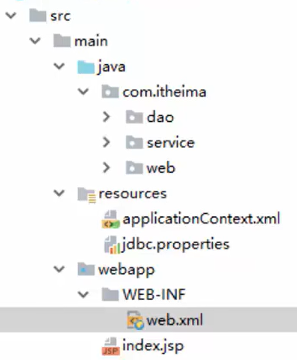

## `Web`环境的集成

在`Spring`实际的开发中，有三层基本架构环境：`dao`层、`Service`层和`Web`层

***

### 环境的基本搭建

在一个具体的项目模块中，其具体的代码文件结构如下所示：



对于`Web`层，我们需要通过`Spring`与`Web`环境进行集成，因此，在`Web`层中，要使用相应的`Web`层组件，使用这些组件，我们首先需要进行坐标的添加，在`pom.xml`文件中添加：

```xml
<dependency>
    <groupId>org.springframework</groupId>
    <artifactId>spring-context</artifactId>
    <version>5.0.5.RELEASE</version>
</dependency>
<dependency>
	<groupId>javax.servlet</groupId>
    <artifactId>javax.servlet-api</artifactId>
    <version>3.0.1</version>
    <scpoe>provided</scpoe>
</dependency>
<dependency>
	<groupId>javax.servlet.jsp</groupId>
    <artifactId>javax.servlet.jsp-api</artifactId>
    <version>5.2.1</version>
    <scpoe>provided</scpoe>
</dependency>
```

使用原始注解的方式进行优化：

1. 编写`Dao`接口和实现类（创建`Bean`）

   在`src/main/java`文件夹中创建接口

   ```java
   package com.jlc.dao;
   
   public interface UserDao {
       public void save();
   }
   ```

   为这个接口创建对应的实现：

   ```java
   package com.jlc.dao.impl;
   
   import com.jlc.dao.UserDao;
   
   @Repository("userDao")
   public class UserDaoImpl implements UserDao {
       // 实现接口的save方法
       public void save() {
           System.out.println("save running");
       }
   }
   ```

2. 创建业务层（`Service`）的代码：在`src/main/java`文件夹中创建：

   ```java
   package com.jlc.service;
   
   // 声明业务层的接口
   public interface UserService {
       public void save();
   }
   ```

   为接口创建一个实现：

   ```java
   package com.jlc.service.impl;
   
   import com.jlc.service.UserService;
   
   @Service("userService")
   public class UserServiceImpl implements UserService {
       @Autowired    // 表示自动注入
       @Qualifier("userDao")   // 依赖注入，按照id的值从容器中进行匹配的，此处的@Qualifier必须结合@Autowired一起进行使用
       private UserDao userDao;
       
       public void save() {
           userDao.save();  // 调用userDao的save()方法
       }
   }
   ```

3. 这事`Spring`配置文件`applicationContext.xml`中的`<bean>`内容可以进行删除，同时要告知`Spring`使用了注解的方式

   ```xml
   <?xml version="1.0" encoding="UTF-8"?>
   <beans xmlns="http://www.springframework.org/schema/beans"
   xmlns:xsi="http://www.w3.org/2001/XMLSchema-instance"
   xmlns:context="http://www.springframework.org/schema/context"
   xsi:schemaLocation="http://www.springframework.org/schema/beans
   http://www.springframework.org/schema/beans/spring-beans.xsd
   http://www.springframework.org/schema/context
   http://www.springframework.org/schema/context/spring-context.xsd">
   
       <!--配置组件扫描-->
       <context:component-scan base-package="com.jlc"></context:component-scan>
   </beans>
   ```

4. 在`src/main/java`中添加一个`Web`层：

   ```java
   package com.jlc.web;
   
   import javax.servlet.http.HttpServlet;
   
   public class UserServlet extends HttpServlet {  // 继承HttpServlet类
       protected void doGet(HttpServletRequest req, HttpServletResponse resp) throws Exception {
           ApplicationContext app = new ClassPathXmlApplicationContext("applicationContext.xml");
           UserService userService = app.getBean(UserService.class);  
           userDao.save();  // 调用save()方法
       }
   }
   ```

   在`web.xml`配置文件中进行配置：

   ```xml
   <?xml version="1.0" encoding="UTF-8"?>
   <web-app version="3.0" 
       xmlns="http://java.sun.com/xml/ns/javaee" 
       xmlns:xsi="http://www.w3.org/2001/XMLSchema-instance"
       xsi:schemaLocation="http://java.sun.com/xml/ns/j2ee 
           http://java.sun.com/xml/ns/j2ee/web-app_2_4.xsd">
       
       <servlet>
           <servlet-name>UserServlet</servlet-name>
           <servlet-class>com.jlc.web.UserServlet</servlet-class>
       </servlet>
       <!--进行映射配置-->
       <servlet-mapping>
           <servlet-name>UserServlet</servlet-name>
           <url-pattern>/userServlet</url-pattern>
       </servlet-mapping>
   </web-app>
   ```

5. 配置完`Web`层后，我们的工程要在`Web`环境下进行测试，需要通过`http`的协议去访问

   将模块发布到`Tomcat8`-->`Edit Configuratios...`-->`Deployment`-->`+`-->`Artifacts`-->`模块文件名_mvc:war exploded`-->`OK`

   配置完后，点击右上角的启动按钮，之后再浏览器中输入`localhost:8080/userServlet`，回车，就可以在控制台看到输出的`save running`

   这一个过程就实现了`Web`层调用`Service`层，`Service`层调`Dao`层

***

### `ApplicationContext`应用上下文获取方式

在`Web`层的具体代码中：

```java
package com.jlc.web;

import javax.servlet.http.HttpServlet;

public class UserServlet extends HttpServlet {  // 继承HttpServlet类
    protected void doGet(HttpServletRequest req, HttpServletResponse resp) throws Exception {
        ApplicationContext app = new ClassPathXmlApplicationContext("applicationContext.xml");
        UserService userService = app.getBean(UserService.class);  
        userDao.save();  // 调用save()方法
    }
}
```

应用上下文对象是通过`new ClassPathXmlApplicationContext(Spring配置文件)`的方式获取的，但是每次从容器中获得`Bean`时都要编写`new ClassPathXmlApplicationContext(Spring配置文件)`，这样的缺点是配置文件要被加载多次，应用上下文对象会被创建多次，会影响性能

在`Web`项目中，可以使用`ServletContextListener`监听`Web`应用的启动，我们可以在`Web`应用启动时，就加载`Spring`配置文件，创建应用上下文对象`ApplicationContext`，在将其存储到最大的域中（`ServletContext`域中），这样就可以在`Web`层的任意位置都可以域中获得应用上下文`ApplicationContext`对象了

#### 自定义监听器

在`src/main/java`中创建`listener`包，用于加载应用上下文

```java
package com.jlc.listener;

import javax.servlet.ServletContextEvent;
import javax.servlet.ServletContextListener;

public class ContextLoaderListener implements ServletContextListener {
    // 上下文初始化的方法
    public void contextInitialized(ServletContextEvent servletContextEvent) {
        ServletContext servletContext = ServletContextEvent.getServletContextEvent();
        // 读取web.xml中的全局参数，使访问的配置文件可以解耦合
        String contextConfigLocation = servletContext.getInitParameter("contextConfigLocation");
        ApplicationContext app = new ClassPathXmlApplicationContext(contextConfigLocation);
        // 将创建的Spring的应用上下文对象存储到ServletContext域中
        servletContext.setAttribute("app", app);
    }
}
```

创建工具，传入上下文对象，返回`app`对象，在`listener`包下创建：

```java
package com.jlc.listener;

import org.springframework.context.ApplicationContext;
import javax.servlet.ServletContext;

public class WebApplicationContextUtils {
    public static ApplicationContext getWebApplicationContext(ServletContext servletContext) {
        return (ApplicationContext) servletContext.setAttribute("app");
    }
}
```

在`web.xml`配置文件中进行监听器的配置：

```xml
<?xml version="1.0" encoding="UTF-8"?>
<web-app version="3.0" 
    xmlns="http://java.sun.com/xml/ns/javaee" 
    xmlns:xsi="http://www.w3.org/2001/XMLSchema-instance"
    xsi:schemaLocation="http://java.sun.com/xml/ns/j2ee 
        http://java.sun.com/xml/ns/j2ee/web-app_2_4.xsd">
    <!--全局初始化参数-->
    <context-param>
        <param-name>contextConfigLocation</param-name>
        <param-value>applicationContext.xml</param-value>
    </context-param>
    <servlet>
        <servlet-name>UserServlet</servlet-name>
        <servlet-class>com.jlc.web.UserServlet</servlet-class>
    </servlet>
    <servlet-mapping>
        <servlet-name>UserServlet</servlet-name>
        <url-pattern>/userServlet</url-pattern>
    </servlet-mapping>
    <!--监听器的配置-->
    <listener>
        <listener-class>com.jlc.listener.ContextLoaderListener</listener-class>
    </listener>
</web-app>
```

在`Web`层中使用的修改：

```java
package com.jlc.web;

import javax.servlet.http.HttpServlet;
import com.jlc.listener.WebApplicationContextUtils;

public class UserServlet extends HttpServlet {  // 继承HttpServlet类
    protected void doGet(HttpServletRequest req, HttpServletResponse resp) throws Exception {
        ServletContext servletContext = this.getServletContext();
        ApplicationContext app = WebApplicationContextUtils.getWebApplicationContext(servletContext);
        UserService userService = app.getBean(UserService.class);  
        userDao.save();  // 调用save()方法
    }
}
```

#### `Spring`系统提供的监听器

对于自定义监听器的实现代码，`Spring`系统提供了系统的封装，`Spring`提供了一个监听器`ContextLoaderListener`就是对上述自定义监听器的封装，该监听器内部加载`Spring`配置文件，创建应用上下文对象，并存储到`ServletContext`域中，并提供了一个客户端工具`WebApplicationContextUtils`供使用者获得应用上下文对象

有了`Spring`系统提供的监听器，我们只需完成两件事：

1. 在`web.xml`中配置`ContextLoaderListener`监听器

   首先，在`pom.xml`配置文件中导入`spring-web`坐标

   ```xml
   <dependency>
   	<groupId>org.springframework</groupId>
       <artifactId>spring-web</artifactId>
       <version>5.0.5.RELEASE</version>
   </dependency>
   ```

   在`web.xml`配置系统提供的监听器：

   ```xml
   <?xml version="1.0" encoding="UTF-8"?>
   <web-app version="3.0" 
       xmlns="http://java.sun.com/xml/ns/javaee" 
       xmlns:xsi="http://www.w3.org/2001/XMLSchema-instance"
       xsi:schemaLocation="http://java.sun.com/xml/ns/j2ee 
           http://java.sun.com/xml/ns/j2ee/web-app_2_4.xsd">
       <!--全局初始化参数-->
       <context-param>
           <param-name>contextConfigLocation</param-name>
           <param-value>classpath:applicationContext.xml</param-value>
       </context-param>
       <servlet>
           <servlet-name>UserServlet</servlet-name>
           <servlet-class>com.jlc.web.UserServlet</servlet-class>
       </servlet>
       <servlet-mapping>
           <servlet-name>UserServlet</servlet-name>
           <url-pattern>/userServlet</url-pattern>
       </servlet-mapping>
       <!--系统监听器的配置-->
       <listener>
           <listener-class>org.springframework.web.context.ContextLoaderListener</listener-class>
       </listener>
   </web-app>
   ```

2. 使用`WebApplicationContextUtils`获取应用上下文对象`ApplicationContext`

   ```java
   package com.jlc.web;
   
   import javax.servlet.http.HttpServlet;
   import com.jlc.listener.WebApplicationContextUtils;
   
   public class UserServlet extends HttpServlet {  // 继承HttpServlet类
       protected void doGet(HttpServletRequest req, HttpServletResponse resp) throws Exception {
           ServletContext servletContext = this.getServletContext();
           WebApplicationContext app = WebApplicationContextUtils.getWebApplicationContext(servletContext);
           UserService userService = app.getBean(UserService.class);  
           userDao.save();  // 调用save()方法
       }
   }
   ```

