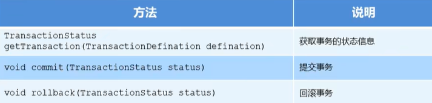
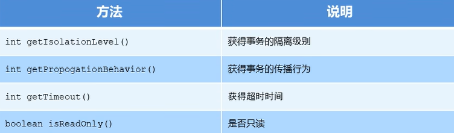
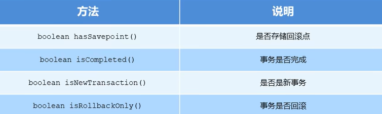

## 事务控制

事务控制的方式有编程式（使用`Java`的`API`进行代码的编写）事务控制和声明式（以配置的方式进行）事务控制

***

### 编程式事务控制

#### 相关对象

- `PlatformTransactionManager`

  `PlatformTransactionManager`接口是`Spring`的事务管理器，它提供了我们常用的事务的操作方法

  

  `PlatformTransactionManager`是接口类型，不同的`Dao`层技术`Spring`系统提供了不同的实现类，如：`Dao`层的技术是`jdbc`或`mybatis`时，`Spring`提供的相应的类实现：`org.springframework.jdbc.datasource.DataSourceTransactionManger`

- `TransactionDefinition`

  `TransactionDefinition`是事务的定义信息对象，内部封装了控制事务的参数，里面的方法有：

  

  > 事务的隔离级别：设置隔离级别，可以解决事务并发产生的问题，如脏读、不可重复读和虚读
  >
  > - `ISOLATION_DEFAULT`
  > - `ISOLATION_READ_UNCOMMITTED`
  > - `ISOLATION_READ_COMMITTED`
  > - `ISOLATION_REPEATABLE_READ`
  > - `ISOLATION_SERIALIZABLE`
  >
  > 事务的传播行为：作用是解决业务行为在调用业务方法时，之间的事务统一性问题，如果对`A`和`B`两个方法都进行了事务控制，那么`A`方法在调用`B`方法时，可能会出现重复或统一的问题
  >
  > - `REQUIRED`：如果当前没有事务，就新建一个事务；如果已经存在一个事务，则加入到这个事务中。默认情况（对于`A`业务方法调用`B`业务方法，`B`业务方法看`A`业务方法当前有没有事务，如果没有事务，那么`B`业务方法就新建一个事务，如果`A`业务方法有事务，那么`B`业务方法就加入到`A`业务方法的事务中）
  > - `SUPPORTS`：支持当前事务，如果当前没有事务，则以非事务方式执行（没有事务）（对于`A`业务方法调用`B`业务方法，`B`业务方法看`A`业务方法当前有没有事务，如果没有事务，那么`B`就以非事务的方式运行，如果`A`业务方法有事务，那么`B`业务方法就支持当前的事务，即一起使用该事务）
  > - `MANDATORY`：使用当前的事务，如果当前没有事务，就抛出异常（对于`A`业务方法调用`B`业务方法，`B`业务方法看`A`业务方法当前有没有事务，如果没有事务，就抛出异常，如果`A`业务方法有事务，那么`B`业务方法就一起使用当前的事务）
  > - `REQUERS_NEW`：新建事务，如果当前存在事务，则挂起当前事务
  > - `NOT_SUPPORTED`：以非事务方式执行操作，如果当前存在事务，就把当前事务挂起
  > - `NEVER`：以非事务方式执行，如果当前存在事务，则抛出异常
  > - `NESTED`：如果当前存在事务，则在嵌套事务内执行；如果当前没有事务，则执行类似 `REQUIRED`的操作
  >
  > 超时时间：默认值是-1，没有超时限制，如果有，以秒为单位进行设置，如果过了超时时间方法还没执行完，就不再等待
  >
  > 是否只读：建议查询时设置为只读

- `TransactionStatus`

  `TransactionStatus`接口提供的是事务具体的运行状态，其方法有：

  

***

### 声明式事务控制

`Spring`的声明式事务控制就是采用声明的方式来处理事务，在配置文件中声明，用在`Spring`配置文件中声明式的处理事务来代替代码式的事务处理，`Spring`声明式事务控制底层就是`AOP`思想

声明式事务处理的作用：

- 事务管理不侵入开发的组件。具体来说，业务逻辑对象不会意识到正在事务管理之中，事实上也应该如此，因为事务管理是属于系统层面的服务，而不是业务逻辑的一部分。如果想要改变事务管理策略的话，也只需要在定义文件中重新配置即可。
- 在不需要事务管理的时候，只要在设定文件上修改一下，即可移去事务管理服务，无需改变代码进行重新编译，这样维护更方便

#### 基于`XML`的声明式事务控制

没有使用事务控制的基本过程：

1. 引入相关坐标（`spring-context`、`aspectjweaver`、`spring-jdbc`、`spring-tx`、`c3p0`、`mysql-connector-java`等）

2. 创建数据库数据表和一个实体对象

   简单创建`account`数据表，其中有字段`name`和`money`

   在项目中创建一个实体，及`Account`对象，在`src/main/java`文件夹中创建：

   ```java
   package com.jlc.domain;
   
   public class Account {
       private String name;
       private double money;
       public String getName() {
           return name;
       }
       public void setName(String name) {
           this.name = name;
       }
       public double getMoney() {
           return monsy;
       }
       public void setMoney(double money) {
           this.money = money;
       }
       public String toString() {
           return "Account{" + "name='" + name + '\'' + ", money=" + money + '}';
       }
   }
   ```

3. 创建具体的实现

   ```java
   package com.jlc.dao.impl;
   
   import com.jlc.dao.AccountDao;
   import org.springframework.jdbc.core.JdbcTemplate;
   
   public class AccountDaoImpl implements AccountDao {
       private JdbcTemplate jdbcTemplate;
       public void setJdbcTemplate(JdbcTemplate jdbcTemplate) {
           this.jdbcTemplate = jdbcTemplate;
       }
       public void out(String outMan, double money) {
           jdbcTemplate.update("update account set money=money-? where name=?", money, outMan);
       }
       public void in(String inMan, double money) {
           jdbcTemplate.update("update account set money=money+? where name=?", money, inMan);
       }
   }
   ```

   `dao`层的方法，在`service`层进行调用：

   ```java
   package com.jlc.service.impl;
   
   import com.jlc.dao.AccountDao;
   import com.jlc.service.AccountService;
   
   public class AccountServiceImpl implements AccountService {
       private AccountDao accountDao;
       public void setAccountDao(AccountDao accountDao) {
           this.accountDao = accountDao;
       }
       
       public void transfer(String outMan, String inMan, double money) {
           // 两个事务
           accountDao.out(outMan, money);
           // 如果这里出现报错，下面的事务就不会执行
           accountDao.in(inMan, money);
       }
   }
   ```

   `service`层的方法，会在业务`Web`（`controller`）层进行调用：

   ```java
   package com.jlc.controller;
   
   import com.jlc.service.AccountService;
   import org.springframework.context.ApplicationContext;
   import org.springframework.context.support.ClassPathXmlApplicationContext;
   
   public class AccountController {
       public static void main(String[] args) {
           ApplicationContext app = new ClassPathXmlApplicationContext(configLocation:"applicationContext.xml");
           AccountService accountService = app.getBean(AccountService.class);
           accountService.transfer("tom", "mark", 500);
       }
   }
   ```

在业务层`controller`进行事务的控制：配置完之后，就会进行事务的控制，出现异常就不会进行统一事务的提交

将开启事务和提交事务融合到具体的方法看成一个切面，将其增强的通知方法提取出去，使用`AOP`的思想作为增强进行织入，切点就是一个业务方法`transfer`；通知就是事务增强的功能；

在`applicationContext.xml`配置文件中进行配置

```xml
<?xml version="1.0" encoding="UTF-8"?>
<beans xmlns="http://www.springframework.org/schema/beans"
xmlns:xsi="http://www.w3.org/2001/XMLSchema-instance"
xmlns:tx="http://www.springframework.org/schema/tx"
xmlns:aop="http://www.springframework.org/schema/aop"
xsi:schemaLocation="http://www.springframework.org/schema/beans
http://www.springframework.org/schema/beans/spring-beans.xsd
http://www.springframework.org/schema/tx
http://www.springframework.org/schema/tx/spring-tx.xsd
http://www.springframework.org/schema/aop
http://www.springframework.org/schema/aop/spring-aop.xsd">
    
    <bean id="accountDao" class="com.jlc.dao.impl.AccountDaoImpl">
		<property name="jdbcTemplate" ref="jdbcTemplate">
    </bean>
    <!--目标对象，其内部的方法就是切点-->
    <bean id="accountService" class="com.jlc.service.impl.AccountServiceImpl">
        <property name="accountDao" ref="accountDao">
    </bean>
    <!--配置平台事务管理器，适用于jdbc模板-->
    <bean id="transactionManager" class="org.springframework.jdbc.datasource.DataSourceTransactionManager">
        <property name="dataSource" ref="dataSource"/>
    </bean>
    <!--通知：事务的增强-->
    <tx:advice id="txAdvice" transaction-manager="transactionManager">
        <!--设置事务的属性信息-->
        <tx:attributes>
            <tx:method name="transfer" isolation="DEFAULT", propagation="REQUIRED", timeout="-1", read-only="false"/>
        </tx:attributes>
    </tx:advice>
    <!--配置事务控制的织入-->
    <aop:config>
        <aop:advisor advice-ref="txAdvice" pointcut="execution(* com.jlc.service.impl.*.*(..))"></aop:advisor>
    </aop:config>
    
</beans>
```

> `xmlns:tx`是我们事务的命名空间，同时还要在`pom.xml`中引入``spring-tx``的坐标
>
> `<tx:attributes>`表示配置事务的属性：其中`tx:method`表示切点方法的事务参数的配置
>
> - `name`：切点方法名称，可以使用*表示所有的方法
> - `isolation`：事务的隔离级别，默认值为`DEFAULT`
> - `propagation`：事务的传播行为，默认值为`REQUIRED`
> - `timeout`：超时时间，默认值为`-1`
> - `read-only`：是否只读，默认值为`false`

#### 基于注解的声明式事务控制

创建具体的实现`dao`层

```java
package com.jlc.dao.impl;

import com.jlc.dao.AccountDao;
import org.springframework.jdbc.core.JdbcTemplate;

@Repository("accountDao")
public class AccountDaoImpl implements AccountDao {
    @Autowired
    private JdbcTemplate jdbcTemplate;
    
    public void out(String outMan, double money) {
        jdbcTemplate.update("update account set money=money-? where name=?", money, outMan);
    }
    public void in(String inMan, double money) {
        jdbcTemplate.update("update account set money=money+? where name=?", money, inMan);
    }
}
```

`dao`层的方法，在`service`层进行调用：

```java
package com.jlc.service.impl;

import com.jlc.dao.AccountDao;
import com.jlc.service.AccountService;

@Service("accountService")
public class AccountServiceImpl implements AccountService {
    @Autowired
    private AccountDao accountDao;
    
    @Transactional(isolation = Isolation.READ_COMMITTED, propagation = Propagation.REQUIRED)
    public void transfer(String outMan, String inMan, double money) {
        accountDao.out(outMan, money);
        accountDao.in(inMan, money);
    }
}
```

> 注解`@Transactional`在需要进行事务控制的类或者方法上进行修饰，注解可用的属性与`xml`配置方式一致
>
> 如：`@Transactional(isolation = Isolation.READ_COMMITTED, propagation = Propagation.REQUIRED)`可以在具体的方法上添加，表示该方式受到事务控制（优先级高），也可以在具体的类上添加，表示当前类中的所有方法，都使用该配置的事务进行事务控制

`service`层的方法，会在业务`Web`（`controller`）层进行调用：

```java
package com.jlc.controller;

import com.jlc.service.AccountService;
import org.springframework.context.ApplicationContext;
import org.springframework.context.support.ClassPathXmlApplicationContext;

public class AccountController {
    public static void main(String[] args) {
        ApplicationContext app = new ClassPathXmlApplicationContext(configLocation:"applicationContext.xml");
        AccountService accountService = app.getBean(AccountService.class);
        accountService.transfer("tom", "mark", 500);
    }
}
```

在`applicationContext.xml`配置文件中配置组件扫描，同时添加事务的注解驱动：

```xml
<!--配置组件扫描-->
<context:component-scan base-package="com.jlc"/>

<!--配置平台事务管理器，适用于jdbc模板-->
<bean id="transactionManager" class="org.springframework.jdbc.datasource.DataSourceTransactionManager">
    <property name="dataSource" ref="dataSource"/>
</bean>

<!--配置事务的注解驱动-->
<tx:annotation-driven transaction-manager="transactionManager"/>
```

