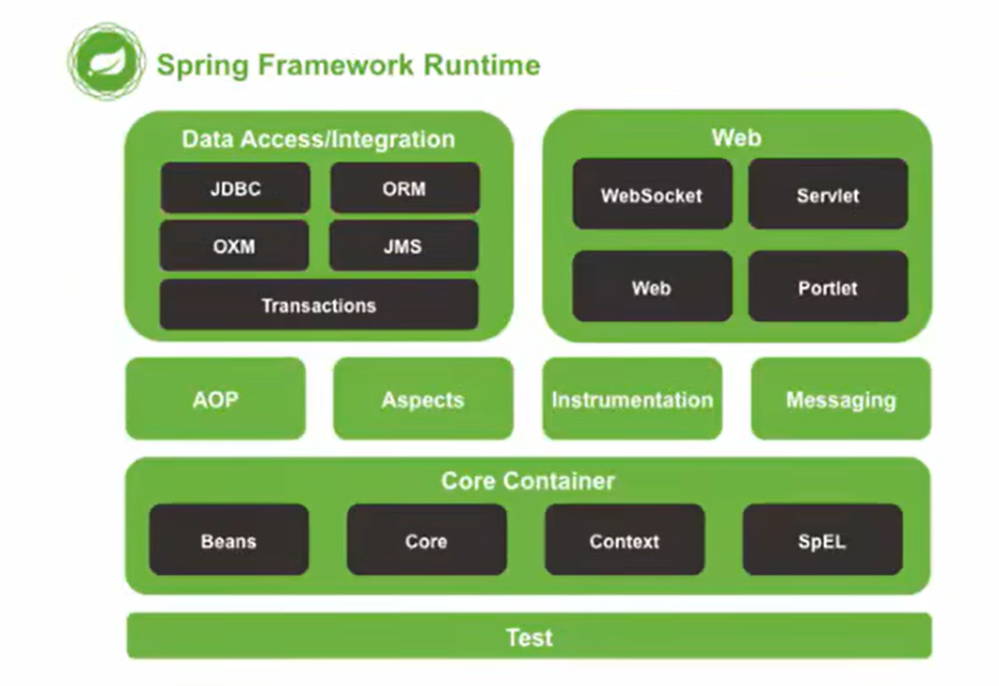

## 基本概念

`Spring`框架是为了解决软件开发的复杂性而创建的。`Spring`使用的是基本的`JavaBean`来完成以前只可能由`EJB`完成的事情。然而，`Spring`的用途不仅仅限于服务器端的开发。从简单性、可测试性和松耦合性角度而言，绝大部分`Java`应用都可以从`Spring`中受益。

`Spring`是分层的`Java SE/EE`应用`full-stack`（各层都有解决方案）轻量级开源框架，以`IoC`反转控制和`AOP`面向切面编程为内核

`Spring`提供了展现层`SpringMVC`（`Web`层）和持久层`Spring JDBCTemplate`以及业务层事务管理等众多的企业级应用技术，还能整合开源世界中众多著名的第三方框架和类库，逐渐成为使用最多的`Java EE`企业应用开源框架

`Spring`的优势：

- 方便解耦，简化开发

  通过`Spring`提供的`IoC`容器，可以将对象间的依赖关系交由`Spring`进行控制，避免硬编码造成的过度耦合，用户也不必再为单例模式类，属性文件解析等底层的需求编写代码，可以更专注于上层任务

- `AOP`编程的支持

  通过`Spring`的`AOP`功能，方便进行面向切面编程，许多不容易用传统`OOP`实现的功能可以通过`AOP`实现

- 声明式事务的支持

  可以将我们从单调烦闷的事务管理代码（提交事务，回滚等）中解脱出来，通过声明方式灵活的进行事务管理，提高开发效率和质量

- 方便程序的测试

  可以用非容器依赖的编程方式进行几乎所有的测试工作，测试不再是昂贵的操作，而是随手可做的事情

- 方便集成各种优秀的框架

  `Spring`对各种优秀的框架（`Struts`、`Hibemate`、`Hessian`、`Quartz`等框架）有很好的支持

- 降低`Java EE API`的使用难度

  `Spring`对`Java EE API`（如`JDBC`、`JavaMail`、远程调用等）进行了薄薄的封装层（模板），使这些`API`的使用难度大为降低

- `Spring`的源代码设计巧妙，处处体现了`Java`设计模式的灵活运用，其源代码是`Java`技术学习的最好典范

`Spring`的体系结构

> - 最顶部的两层是数据访问层和`Web`应用层，其实现要借助中间层的工具
> - 中间层包括`AOP`和切面等编程技术
> - `Core Container`：核心容器，主要涉及的是`IoC`的知识点，有主要的四个部分：产生对象的容器、核心、上下文和`Spring`的表达式语言
> - `Test`表示整体的框架都可以进行测试