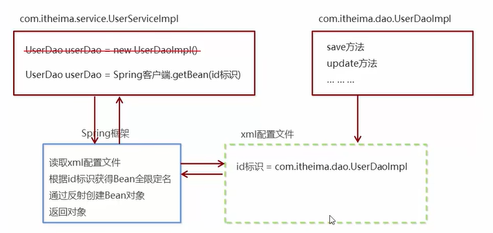

## 开发步骤

`Spring`框架的基本开发步骤为：

1. 导入`Spring`开发的基本包坐标

   依赖坐标是一种标识符，用来指明我们需要使用的库或框架的版本信息。在`Maven`构建工具中，通过添加依赖坐标来告诉构建工具需要下载并引入哪些库文件

   在具体模块的`pom.xml`文件中导入基本的包坐标

   ```xml
   <dependency>
       <groupId>org.springframework</groupId>
       <artifactId>spring-context</artifactId>
       <version>5.3.9</version>
   </dependency>
   ```

2. 编写`Dao`接口和实现类（创建`Bean`）

   在`src/main/java`文件夹中创建接口

   ```java
   package com.jlc.dao;
   
   public interface UserDao {
       public void save();
   }
   ```

   为这个接口创建对应的实现：

   ```java
   package com.jlc.dao.impl;
   
   import com.jlc.dao.UserDao;
   
   public class UserDaoImpl implements UserDao {
       // 实现接口的save方法
       public void save() {
           System.out.println("save running");
       }
   }
   ```

3. 创建`Spring`核心配置文件（一般叫做`applicationContext.xml`）

4. 在`Spring`配置文件中配置`UserDaolmpl`

   将全包名配置到配置文件的内部，通过`id`去标识这个全限定名（后续可以通过这个`id`标识去获取这个全限定名）

   在`src/main/resources`文件夹中创建`Spring`配置文件`applicationContext.xml`

   ```xml
   <?xml version="1.0" encoding="UTF-8"?>
   <beans xmlns="http://www.springframework.org/schema/beans"
   xmlns:xsi="http://www.w3.org/2001/XMLSchema-instance"
   xmlns:context="http://www.springframework.org/schema/context"
   xsi:schemaLocation="http://www.springframework.org/schema/beans
   http://www.springframework.org/schema/beans/spring-beans.xsd
   http://www.springframework.org/schema/context
   http://www.springframework.org/schema/context/spring-context.xsd">
       
   	<!-- bean定义和其他配置 -->
       <bean id="userDao" class="com.jlc.dao.impl.UserDaoImpl"></bean>
       
   </beans>
   ```

   > `id`标识配置具体的标识；`class`表示配置具体的全限定名

5. 引入`Spring`框架（框架的作用是读取这个`xml`配置文件），使用`Spring`的`API`获取`Bean`实例（获取全包名，通过反射创建`Bean`对象，默认情况下反射是通过无参构造去创建对象的）

   ```java
   package com.jlc.demo;
   
   public class UserDaoDemo {
       public static void main(String[] args) {
           // 获得容器中，由Spring进行创建的userDao
           ApplicationContext app = new ClassPathXmlApplicationContext(configLocation:"applicationContext.xml");
           UserDao userDao = (UserDao) app.getBean(s:"userDao");  // 通过标识去获取具体的对象
           userDao.save();  // 调用save()方法
       }
   }
   ```



`Spring`框架的作用就是读取`XML`配置文件的，从而获得我们的全包名；

上述的过程完成了解耦，代码可以不进行修改，我们只需要修改其配置文件（在开发阶段和运行阶段是保持不变的），就可以实现相应的功能