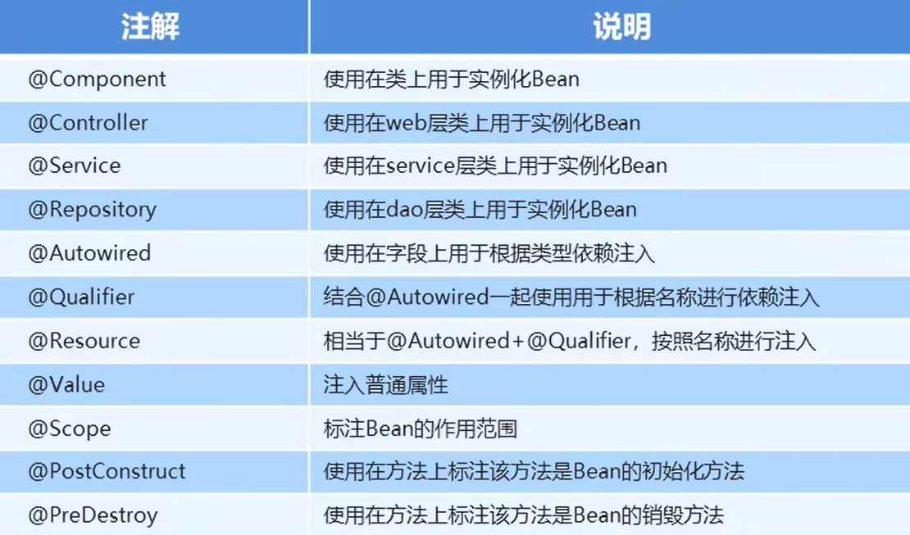
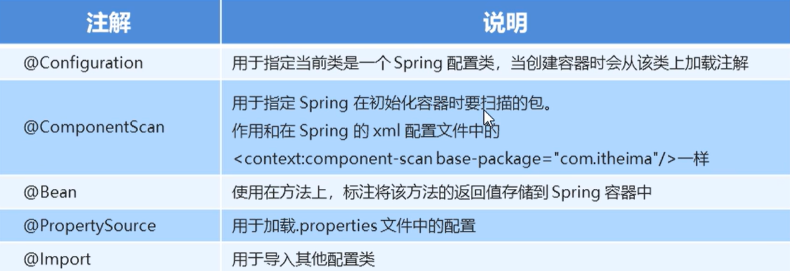

## 注解开发

`Spring`是轻代码而重配置的框架，配置比较繁重，影响开发效率，所以注解开发是一种趋势，注解替代`xml`配置文件可以简化配置，提高开发效率

不使用注解的开发方式：

1. 编写`Dao`接口和实现类（创建`Bean`）

   在`src/main/java`文件夹中创建接口

   ```java
   package com.jlc.dao;
   
   public interface UserDao {
       public void save();
   }
   ```

   为这个接口创建对应的实现：

   ```java
   package com.jlc.dao.impl;
   
   import com.jlc.dao.UserDao;
   
   public class UserDaoImpl implements UserDao {
       // 实现接口的save方法
       public void save() {
           System.out.println("save running");
       }
   }
   ```

2. 创建业务层（`Service`）的代码：在`src/main/java`文件夹中创建：

   ```java
   package com.jlc.service;
   
   // 声明业务层的接口
   public interface UserService {
       public void save();
   }
   ```

   为接口创建一个实现：

   ```java
   package com.jlc.service.impl;
   
   import com.jlc.service.UserService;
   
   public class UserServiceImpl implements UserService {
       private UserDao userDao;
       public void setUserDao(UserDao userDao) {
           this.userDao = userDao;
       }
       public void save() {
           userDao.save();  // 调用userDao的save()方法
       }
   }
   ```

3. 创建`Spring`核心配置文件并配置

   在`src/main/resources`文件夹中创建`Spring`配置文件`applicationContext.xml`

   ```xml
   <?xml version="1.0" encoding="UTF-8"?>
   <beans xmlns="http://www.springframework.org/schema/beans"
   xmlns:xsi="http://www.w3.org/2001/XMLSchema-instance"
   xmlns:context="http://www.springframework.org/schema/context"
   xsi:schemaLocation="http://www.springframework.org/schema/beans
   http://www.springframework.org/schema/beans/spring-beans.xsd
   http://www.springframework.org/schema/context
   http://www.springframework.org/schema/context/spring-context.xsd">
       
   	<!-- bean定义和其他配置 -->
       <bean id="userDao" class="com.jlc.dao.impl.UserDaoImpl"></bean>
       <bean id="userService" class="com.jlc.service.impl.UserServiceImpl">
           <constructor-srg name="userDao" ref="userDao"></constructor-srg>
       </bean>
   </beans>
   ```

4. 创建一个虚拟的`Web`层进行测试，在`src/main/java`文件夹中创建：

   ```java
   package com.jlc.web;
   
   import org.springframework.context.ApplicationContext;
   
   public class UserController {
       public static void main(String[] args) {
           ApplicationContext app = new ClassPathXmlApplicationContext(configLocation:"applicationContext.xml");
           UserService userService = app.getBean(UserService.class); 
           userService.save();
       }
   }
   ```

***

### `Spring`原始注解

`Spring`原始注解主要是替代`<Bean>`标签的配置，其相关的原始注解有：



> `@Controller`、`@Service`和`@Repository`注解的功能和`@Component`注解是一样的，只是前面三个具有语义化的功能，在具体的层上实例化`Bean`

使用原始注解的方式进行优化：

1. 编写`Dao`接口和实现类（创建`Bean`）

   在`src/main/java`文件夹中创建接口

   ```java
   package com.jlc.dao;
   
   public interface UserDao {
       public void save();
   }
   ```

   为这个接口创建对应的实现：

   ```java
   package com.jlc.dao.impl;
   
   import com.jlc.dao.UserDao;
   
   @Component("userDao")  // 可以使用@Repository("userDao")  语义更加明确
   public class UserDaoImpl implements UserDao {
       // 实现接口的save方法
       public void save() {
           System.out.println("save running");
       }
   }
   ```

   > 使用`@Component`来替换`<bean id="userDao" class="com.jlc.dao.impl.UserDaoImpl"></bean>`

2. 创建业务层（`Service`）的代码：在`src/main/java`文件夹中创建：

   ```java
   package com.jlc.service;
   
   // 声明业务层的接口
   public interface UserService {
       public void save();
   }
   ```

   为接口创建一个实现：

   ```java
   package com.jlc.service.impl;
   
   import com.jlc.service.UserService;
   
   @Component("userService")   // 可以使用@Service("userService")  语义更加明确
   @Scope("prototype")   // Scope注解，prototype用于产生多个bean，singleton用于产生一个bean
   public class UserServiceImpl implements UserService {
       @Autowired    // 表示自动注入
       @Qualifier("userDao")   // 依赖注入，按照id的值从容器中进行匹配的，此处的@Qualifier必须结合@Autowired一起进行使用
       private UserDao userDao;
       
       public void save() {
           userDao.save();  // 调用userDao的save()方法
       }
       
       @PostConstruct  // 声明下面的方法是对象的初始化方法
       public void init() {   // 对象的初始化方法
           system.out.println("init"); 
       }
       
       @PreDestory  // 声明下面的方法是对象销毁前执行的方法
       public void destory() {   // 对象的销毁前执行的方法
           system.out.println("destory"); 
       }
   }
   ```

   > - 使用`@Component`来替换`<bean id="userService" class="com.jlc.service.impl.UserServiceImpl"></bean>`
   >
   > - 使用`@Autowired`和`@Qualifier()`来代替`<constructor-srg name="userDao" ref="userDao"></constructor-srg>`进行依赖注入
   >
   > - 使用`xml`配置的方式`setUserDao()`方法是必须要有的，但是使用注解的方法，`setUserDao()`可以删除
   >
   >   ```java
   >   // 该方法可以删除
   >   public void setUserDao(UserDao userDao) {
   >       this.userDao = userDao;
   >   }
   >   ```
   >
   > - 对于`@Qualifier("userDao")`，也可以不写，那么`@Autowired`会按照数据类型从`Spring`容器中根据类型的查找进行自动的匹配（找一个`userDao`类的`Bean`进行注入，如果容器中有多个`userDao`类，那就必须加上`@Qualifier("userDao")`注解）
   >
   > - 我们可以使用`@Resource(name="userDao")`来代替`@Autowired+@Qualifier("userDao")`进行依赖的注入
   >
   > 之前的依赖注入是注入对象引用类型，然而依赖注入也可以注入基本数据类型和集合数据类型：
   >
   > ```java
   > package com.jlc.service.impl;
   > 
   > import com.jlc.service.UserService;
   > 
   > @Component("userService")   // 可以使用@Service("userService")  语义更加明确
   > public class UserServiceImpl implements UserService {
   >     @Value("${jdbc.driver}")   // 基本数据类型的依赖注入
   >     private String driver;
   > 
   >     public void save() {
   >         // 前提是配置文件需要加载数据库文件
   >         system.out.println(driver);   // com.mysql.jdbc.Driver  
   >     }
   > }
   > ```

3. 这事`Spring`配置文件`applicationContext.xml`中的`<bean>`内容可以进行删除，同时要告知`Spring`使用了注解的方式

   ```xml
   <?xml version="1.0" encoding="UTF-8"?>
   <beans xmlns="http://www.springframework.org/schema/beans"
   xmlns:xsi="http://www.w3.org/2001/XMLSchema-instance"
   xmlns:context="http://www.springframework.org/schema/context"
   xsi:schemaLocation="http://www.springframework.org/schema/beans
   http://www.springframework.org/schema/beans/spring-beans.xsd
   http://www.springframework.org/schema/context
   http://www.springframework.org/schema/context/spring-context.xsd">
   
       <!--配置组件扫描-->
       <context:component-scan base-package="com.jlc"></context:component-scan>
   </beans>
   ```

   > 使用注解进行开发时，需要在`Spring`配置文件中配置组件扫描，作用是指定哪个包及其子包下的`Bean`需要进行扫描以识别使用注解配置的类、字段和方法。
   >
   > `com.jlc`下的所有`Bean`都会被扫描，包括其子包下的所有`Bean`

4. 创建一个虚拟的`Web`层进行测试，在`src/main/java`文件夹中创建：

   ```java
   package com.jlc.web;
   
   import org.springframework.context.ApplicationContext;
   
   public class UserController {
       public static void main(String[] args) {
           ApplicationContext app = new ClassPathXmlApplicationContext(configLocation:"applicationContext.xml");
           UserService userService = app.getBean(UserService.class); 
           userService.save();
       }
   }
   ```

***

### `Spring`新注解

在`Spring`的`xml`配置文件中，原始注解只能替代`<bean>`标签的内容（对于自定义的`<bean>`，可以使用原始注解进行简化，对于非自定义的，引入官方的包，我们不可能在源码上加上原始注解），然而，还有一些标签是没有办法使用原始注解进行替换的（如`<context:property-placeholder>`），因此，就引入了新注解

`Spring`新注解有：



`Spring`新注解的使用，一般是创建一个`config`文件夹，在其内部创建一个`SpringConfiguration`文件，作为配置的主文件，其他配置文件的内容在主文件中引入即可，那么，子配置文件也会被加载

```java
package com.jlc.config;

import org.springframework.context.annotation.Configuration;

@Configuration   // 标志该类是Spring的核心配置类
@ComponentScan("com.jlc")   // 组件扫描注解的使用
@Import({DataSourceConfiguration.class})  // 加载子配置文件，加载多个，在{}中用逗号分隔即可
public class SpringConfiguration {

}
```

对于数据库的配置，我们可以将具体的配置放到`DataSourceConfiguration`文件中

```java
package com.jlc.config;

@PropertySource("classpath:jdbc.properties")   // 加载.properties配置文件中的配置
public class DataSourceConfiguration {   // 数据源相关的配置
    @Value("${jdbc.driver}")
    private String driver;
    @Value("${jdbc.url}")
    private String url;
    @Value("${jdbc.username}")
    private String username;
    @Value("${jdbc.password}")
    private String password;
    @Bean("dataSource")  // Spring会将当前方法的返回值以指定名称存储到Spring容器中
    public DataSource getDataSource() throws Expection {
        ComboPooledDataSource dataSource = new ComboPooledDataSource();
        dataSource.setDriverClass(driver);
        dataSource.setJdbcUrl(url);
        dataSource.setUser(username);
        dataSource.setPassword(password);
        return dataSource;
    }
}
```

基于上述使用新注解优化配置后，`applicationContext.xml`中配置内容都可以删除（文件也可以删除）

```xml
<?xml version="1.0" encoding="UTF-8"?>
<beans xmlns="http://www.springframework.org/schema/beans"
xmlns:xsi="http://www.w3.org/2001/XMLSchema-instance"
xmlns:context="http://www.springframework.org/schema/context"
xsi:schemaLocation="http://www.springframework.org/schema/beans
http://www.springframework.org/schema/beans/spring-beans.xsd
http://www.springframework.org/schema/context
http://www.springframework.org/schema/context/spring-context.xsd">

</beans>
```

后续在使用时，进行如下的改写：

```java
package com.jlc.web;

import org.springframework.context.annotation.AnnotationConfigApplicationContext;
import com.jlc.config.SpringConfiguration;

public class UserController {
    public static void main(String[] args) {
        ApplicationContext app = new AnnotationConfigApplicationContext(SpringConfiguration.class);
        UserService userService = app.getBean(UserService.class); 
        userService.save();
    }
}
```

