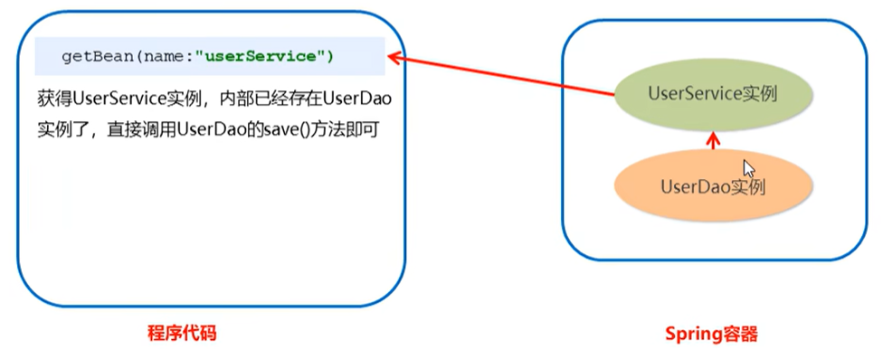

## 配置文件

### `Bean`标签

`Bean`标签用于配置对象交由`Spring`来创建

默认情况下它调用的是类中的无参构造器，如果没有无参构造器则不能创建成功

基本属性：

- `id`：`Bean`实例在`Spring`容器中的唯一标识，是不允许重复的

- `class`：`Bean`的全限定名称

- `scope`：`Bean`标签的范围配置，指对象的作用范围，取值如下：

  |     取值范围     |                             描述                             |
  | :--------------: | :----------------------------------------------------------: |
  |   `singleton`    | 默认值，单例的（容器中存在的对象只有一个，即每次在`getBean`实例出对象时，指向的是同一个对象） |
  |   `prototype`    | 多例的（从容器中获取对象有多个对象，即每次在`getBean`时，都会获取新的对象） |
  |    `request`     | `WEB`项目中，`Spring`创建一个`Bean`的对象，将对象存入到`request`域中 |
  |    `session`     | `WEB`项目中，`Spring`创建一个`Bean`的对象，将对象存入到`session`域中 |
  | `global session` | `WEB`项目中，应用在`Portlet`环境，如果没有`Portlet`环境，那么`global session`相当于`session` |

  > - 当`scope`的取值为`singleton`时，`Bean`的实例化个数是一个，其`Bean`的实例化时机为当`Spring`核心文件被加载时（`ApplicationContext app = new ClassPathXmlApplicationContext(configLocation:"applicationContext.xml");`），实例化配置的`Bean`实例；`Bean`的生命周期：
  >   - 对象创建：当应用加载，创建容器时，对象就被创建了
  >   - 对象运行：只要容器在，对象一直活着
  >   - 对象销毁：当应用卸载时，销毁容器时，对象就被销毁了
  > - 当`scope`的取值为`prototype`时，`Bean`的实例化个数有多个，其`Bean`的实例化时机为当调用`getBean()`方法时实例化`Bean`；`Bean`的生命周期：
  >   - 对象创建：当使用对象时，创建新的对象实例
  >   - 对象运行：只要对象在使用中，就一直活着
  >   - 对象销毁：当对象长时间不用时，就会被`Java`的垃圾回收器回收

- `init-method="具体方法"`：对象的初始化方法，即在初始化的时候执行指定的方法（这个指定的方法在对象声明存在）

- `destroy-method="具体方法"`：对象的销毁方法，即在对象销毁时执行指定的方法（这个指定的方法在对象声明存在）

  销毁对象：`app.close();`

#### `Bean`实例化的三种方式

`Bean`实例化的方式默认是找其对象的无参构造器方法进行实例化（是重点），但是我们也可以通过配置，让其不找无参构造，使用工厂静态方法实例化和工厂实例方法实例化

工厂静态方法实例化

首先需要创建一个静态工厂：

```java
package com.jlc.factory;

public class StaticFactory {
    // 编写一个静态方法，返回对象实例
    public static UserDao getUserDao() {
        return new UserDaoImpl();
    }
}
```

在`Spring`配置文件中声明使用工厂静态方法进行实例化

```xml
<?xml version="1.0" encoding="UTF-8"?>
<beans xmlns="http://www.springframework.org/schema/beans"
xmlns:xsi="http://www.w3.org/2001/XMLSchema-instance"
xmlns:context="http://www.springframework.org/schema/context"
xsi:schemaLocation="http://www.springframework.org/schema/beans
http://www.springframework.org/schema/beans/spring-beans.xsd
http://www.springframework.org/schema/context
http://www.springframework.org/schema/context/spring-context.xsd">
    
    <bean id="userDao" class="com.jlc.factory.StaticFactory" factory-method="getUserDao"></bean>
    
</beans>
```

> 找全限定名`class="com.jlc.factory.StaticFactory"`内部指定的工厂方法`getUserDao`返回对应的对象（该方法是静态方法，可以不通过类.的方式进行调用）

工厂实例方法实例化

与工厂静态方法实例化类似，但是不是通过静态方法返回对象

```java
package com.jlc.factory;

public class DynamicFactory {
    // 编写一个方法，返回对象实例
    public UserDao getUserDao() {
        return new UserDaoImpl();
    }
}
```

在`Spring`配置文件中声明使用工厂实例方法进行实例化

```xml
<?xml version="1.0" encoding="UTF-8"?>
<beans xmlns="http://www.springframework.org/schema/beans"
xmlns:xsi="http://www.w3.org/2001/XMLSchema-instance"
xmlns:context="http://www.springframework.org/schema/context"
xsi:schemaLocation="http://www.springframework.org/schema/beans
http://www.springframework.org/schema/beans/spring-beans.xsd
http://www.springframework.org/schema/context
http://www.springframework.org/schema/context/spring-context.xsd">
    
    <bean id="factory" class="com.jlc.factory.DynamicFactory"></bean>
    <bean id="userDao" factory-bean="factory" factory-method="getUserDao">
    
</beans>
```

> 由于不是静态方法，首先需要通过`Spring`产生工厂对象，再调用工厂内部的实例化方法

#### 依赖注入

之前的工作，只是让`Spring`帮助我们实例化出`Dao`层的对象，在实际开发中，业务成和`Web`层也是有对应代码的

创建业务层的代码：在`src/main/java`文件夹中创建：

```java
package com.jlc.service;

// 声明业务层的接口
public interface UserService {
    public void save();
}
```

为接口创建一个实现：

```java
package com.jlc.service.impl;

import com.jlc.service.UserService;

public class UserServiceImpl implements UserService {
    public void save() {
        // 调用Dao中的save方法
        ApplicationContext app = new ClassPathXmlApplicationContext(configLocation:"applicationContext.xml");
        UserDao userDao = (UserDao) app.getBean(s:"userDao");  // 通过标识去获取具体的对象
        userDao.save();  // 调用save()方法
    }
}
```

将`UserServiceImpl`也配置到`Spring`容器中：

```xml
<?xml version="1.0" encoding="UTF-8"?>
<beans xmlns="http://www.springframework.org/schema/beans"
xmlns:xsi="http://www.w3.org/2001/XMLSchema-instance"
xmlns:context="http://www.springframework.org/schema/context"
xsi:schemaLocation="http://www.springframework.org/schema/beans
http://www.springframework.org/schema/beans/spring-beans.xsd
http://www.springframework.org/schema/context
http://www.springframework.org/schema/context/spring-context.xsd">
    
	<!-- bean定义和其他配置 -->
    <bean id="userDao" class="com.jlc.dao.impl.UserDaoImpl"></bean>
    <bean id="userService" class="com.jlc.service.impl.UserServiceImpl"></bean>
</beans>
```

编写一个测试文件：

```java
package com.jlc.demo;

public class UserController {
    public static void main(String[] args) {
        ApplicationContext app = new ClassPathXmlApplicationContext(configLocation:"applicationContext.xml");
        UserService userService = (UserService) app.getBean(s:"userService");
        userService.save();  // 调用save()方法
    }
}
```

目前`UserService`实例和`UserDao`实例都存在于`Spring`容器中，但最终程序直接使用的可能是`UserService`，所以可以在`Spring`容器中，上述做法是在`Spring`容器外将`Dao`组装到`Service`内部完成后续的操作

我们可以在`Spring`容器中，将`UserDao`设置到`UserService`内部，这个过程就是依赖注入



依赖注入是`Spring`框架核心`IOC`的具体实现，在编写程序时，通过控制反转，把对象的创建交给了`Spring`，但是代码中不可能出现没有依赖的情况。`IOC`解耦只是降低他们的依赖关系，但不会消除。

通过依赖注入，业务层和持久层的依赖关系，在使用`Spring`之后，就让`Spring`来配置和维护了，简而言之，就是让框架把持久层对象传入业务从鞥，而不用我们自己去获取

依赖注入有两种方式：

- `set`方法：为某个属性设置值（即注入值）

  ```java
  // 在UserServiceImpl中通过set方法进行依赖注入
  package com.jlc.service.impl;
  
  import com.jlc.service.UserService;
  
  public class UserServiceImpl implements UserService {
      private UserDao userDao;   // 用于接收容器中的userDao
      public void setUserDao(UserDao userDao) {
          this.userDao = userDao;
      }
      
      public void save() {
          userDao.save();  // 调用save()方法
      }
  }
  ```

  在`Spring`配置文件中声明依赖注入

  ```xml
  <?xml version="1.0" encoding="UTF-8"?>
  <beans xmlns="http://www.springframework.org/schema/beans"
  xmlns:xsi="http://www.w3.org/2001/XMLSchema-instance"
  xmlns:context="http://www.springframework.org/schema/context"
  xsi:schemaLocation="http://www.springframework.org/schema/beans
  http://www.springframework.org/schema/beans/spring-beans.xsd
  http://www.springframework.org/schema/context
  http://www.springframework.org/schema/context/spring-context.xsd">
      
  	<!-- bean定义和其他配置 -->
      <bean id="userDao" class="com.jlc.dao.impl.UserDaoImpl"></bean>
      <bean id="userService" class="com.jlc.service.impl.UserServiceImpl">
          <property name="userDao" ref="userDao"></property>
      </bean>
  </beans>
  ```

  > `<property name="userDao" ref="userDao"></property>`中的`name`是`set`方法后面的部分，大写字母变成小写；`ref`表示将具体的唯一标识进行注入（对象的引用用`ref`）

  `set`方法进行依赖注入，有一个简化的方式，即`P`命名空间注入，主要的区别体现在配置文件中（使用属性的方式代替具体的子标签）：

  ```xml
  <?xml version="1.0" encoding="UTF-8"?>
  <beans xmlns="http://www.springframework.org/schema/beans"
  xmlns:xsi="http://www.w3.org/2001/XMLSchema-instance"
  xmlns:context="http://www.springframework.org/schema/context"
  xsi:schemaLocation="http://www.springframework.org/schema/beans
  http://www.springframework.org/schema/beans/spring-beans.xsd
  http://www.springframework.org/schema/context
  http://www.springframework.org/schema/context/spring-context.xsd"
  xmlns:p="http://www.springframework.org/schema/p">
      
  	<!-- bean定义和其他配置 -->
      <bean id="userDao" class="com.jlc.dao.impl.UserDaoImpl"></bean>
      <bean id="userService" class="com.jlc.service.impl.UserServiceImpl" p:userDao-ref="userDao"></bean>
  </beans>
  ```

- 构造方法：通过有参构造，将数据注入到其他对象的内部

  ```java
  // 在UserServiceImpl中通过构造方法进行依赖注入
  package com.jlc.service.impl;
  
  import com.jlc.service.UserService;
  
  public class UserServiceImpl implements UserService {
      private UserDao userDao;   // 用于接收容器中的userDao
      public UserServiceImpl(UserDao userDao) {   // 有参构造
          this.userDao = userDao;
      }
      
      // 使用的有参构造，会覆盖无参构造，我们要重新声明
      public UserServiceImpl() {}
      
      public void save() {
          userDao.save();  // 调用save()方法
      }
  }
  ```

  在`Spring`配置文件中声明依赖注入

  ```xml
  <?xml version="1.0" encoding="UTF-8"?>
  <beans xmlns="http://www.springframework.org/schema/beans"
  xmlns:xsi="http://www.w3.org/2001/XMLSchema-instance"
  xmlns:context="http://www.springframework.org/schema/context"
  xsi:schemaLocation="http://www.springframework.org/schema/beans
  http://www.springframework.org/schema/beans/spring-beans.xsd
  http://www.springframework.org/schema/context
  http://www.springframework.org/schema/context/spring-context.xsd">
      
  	<!-- bean定义和其他配置 -->
      <bean id="userDao" class="com.jlc.dao.impl.UserDaoImpl"></bean>
      <bean id="userService" class="com.jlc.service.impl.UserServiceImpl">
          <constructor-srg name="userDao" ref="userDao"></constructor-srg>
      </bean>
  </beans>
  ```

  > `<constructor-srg name="userDao" ref="userDao"></constructor-srg>`中的`name`是`UserServiceImpl`内部对应的私有属性名；`ref`表示将具体的唯一标识进行注入（对象的引用用`ref`）

##### 依赖注入的数据类型

对于注入的引用`Bean`，除了对象的引用类型可以注入，普通的数据类型、集合等都可以在容器中进行注入

注入数据的三种数据类型：既可以通过`set`方法，也可以通过构造函数的方法，这里只演示`set`方法

- 普通数据类型

  ```java
  // 在UserServiceImpl中通过set方法进行普通数据类型的依赖注入
  package com.jlc.service.impl;
  
  import com.jlc.service.UserService;
  
  public class UserServiceImpl implements UserService {
      private String userName;   // 用于接收容器中的注入的username
      private int age;   // 用于接收容器中的注入的age
      public void setUserName(String userName) {
          this.userName = userName;
      }
      public void setAge(int age) {
          this.age = age;
      }
      
      public void save() {
          System.out.println(userName, age);   // zhangsan, 25
      }
  }
  ```

  在`Spring`配置文件中声明依赖注入

  ```xml
  <?xml version="1.0" encoding="UTF-8"?>
  <beans xmlns="http://www.springframework.org/schema/beans"
  xmlns:xsi="http://www.w3.org/2001/XMLSchema-instance"
  xmlns:context="http://www.springframework.org/schema/context"
  xsi:schemaLocation="http://www.springframework.org/schema/beans
  http://www.springframework.org/schema/beans/spring-beans.xsd
  http://www.springframework.org/schema/context
  http://www.springframework.org/schema/context/spring-context.xsd">
      
  	<!-- bean定义和其他配置 -->
      <bean id="userDao" class="com.jlc.dao.impl.UserDaoImpl"></bean>
      <bean id="userService" class="com.jlc.service.impl.UserServiceImpl">
          <property name="userName" value="zhangsan"></property>
          <property name="age" value="25"></property>
      </bean>
  </beans>
  ```

  > 普通属性值进行依赖注入使用`value`

- 引用数据类型：之前对象引用的注入（对象引用进行依赖注入使用`ref`）

- 集合数据类型

  ```java
  // 在UserServiceImpl中通过set方法进行集合数据类型的依赖注入
  package com.jlc.service.impl;
  
  import com.jlc.service.UserService;
  
  public class UserServiceImpl implements UserService {
      private List<String> strList;
      private Map<String, User> userMap;   // User是一个对象
      private Properties properties;
      
      public void setStrList(List<String> strList) {
          this.strList = strList;
      }
      public void setUserMap(Map<String, User> userMap) {
          this.userMap = userMap;
      }
      public void setProperties(Properties properties) {
          this.properties = properties;
      }
      
      public void save() {
          System.out.println(strList);   // [aa, bb, cc]
          System.out.println(userMap);   // {u1=User{name='jack', addr='hangzhou'}, u2=User{name='mary', addr='shanghai'}}
          System.out.println(properties);   // {p2=PPP, p1=ppp}
      }
  }
  ```

  在`Spring`配置文件中声明依赖注入

  ```xml
  <?xml version="1.0" encoding="UTF-8"?>
  <beans xmlns="http://www.springframework.org/schema/beans"
  xmlns:xsi="http://www.w3.org/2001/XMLSchema-instance"
  xmlns:context="http://www.springframework.org/schema/context"
  xsi:schemaLocation="http://www.springframework.org/schema/beans
  http://www.springframework.org/schema/beans/spring-beans.xsd
  http://www.springframework.org/schema/context
  http://www.springframework.org/schema/context/spring-context.xsd">
      
  	<!-- bean定义和其他配置 -->
      <bean id="userDao" class="com.jlc.dao.impl.UserDaoImpl"></bean>
      <bean id="userService" class="com.jlc.service.impl.UserServiceImpl">
          <property name="strList">
              <List>
                  <value>aa</value>
                  <value>bb</value>
                  <value>cc</value>
              </List>
          </property>
          <property name="userMap" value="25">
              <Map>
                  <entry key="u1" value-ref="user1"></entry>
                  <entry key="u2" value-ref="user2"></entry>
              </Map>
          </property>
          <property name="properties">
              <props>
                  <prop key='p1'>ppp</prop>
                  <prop key='p2'>PPP</prop>
              </props>
          </property>
      </bean>
      
      <bean id="user1" class=com.jlc.domain.User>
          <property name="name" value="jack"></property>
          <property name="addr" value="hangzhou"></property>
      </bean>
      <bean id="user2" class=com.jlc.domain.User>
          <property name="name" value="mary"></property>
          <property name="addr" value="shanghai"></property>
      </bean>
  </beans>
  ```

  > 集合属性值使用内部的具体对应子标签进行依赖的注入，子标签具体注入的值如果是基本数据类型，使用`<value>`标签进行包裹，如果是对象引用类型，使用`<ref>`标签进行包裹

***

### `import `标签

`import `标签用于引入其他配置文件

在实际开发中，`Spring`的配置文件内容一般非常多，不方便后期的维护，所以我们通常将配置文件中的部分配置拆分到其他配置文件中，而在`Spring`主配置文件中通过`import`标签进行加载开发

```xml
<import resource="applicationContext-xxx.xml"/>
```

> 引入之后，加载主配置文件，其引用的分配置文件也会被一起进行加载

