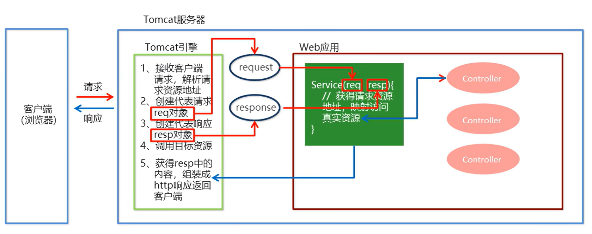

## 基本概念

`SpringMVC`是一种基于`Java`实现的`MVC`设计模型（`M`：模型，主要用于数据封装和业务逻辑处理；`V`：视图，主要用于数据的展示；`C`：控制器，主要用于分发指派工作）的请求驱动类型的轻量级`Web`框架，属于`SpringFrameWork`的后续产品，已经融合在`Spring Web Flow`中

`SpringMVC`已经成为目前最主流的`MVC`框架之一，并且随着`Spring3.0`的发布，全面超越`Struts2`，成为最优秀的`MVC`框架。它通过一套完善的注解机制，让一个简单的`Java`类成为处理请求的控制器，而无须实现任何接口。同时它还支持`RESTful`编程风格的请求

对于`Web`层，在实际开发中，会出现很多的`Servlet`，用于处理不同功能的`Web`实现。对于每一个`Servlet`，其执行的行为有很多都是一致的（重复的）（一般情况下`Servlet`其内部执行的动作为接收请求参数、封装实体、访问业务层、接收返回结果和指派页面等），对于一致的行为，我们需要对其进行功能的抽取，让一个组件去完成这些通用共有行为的操作（`Web`层相应的框架去完成），同时，具体`Web`层的组件去完成一些特有的行为操作

`SpringMVC`流程图：

`SpringMVC`的基本开发步骤：

1. 导入`SpringMVC`相关坐标
2. 配置`SpringMVC`核心控制器`DispathcerServlet`，每个请求都要通过共有行为的前端控制器
3. 编写`POJO`（即控制器`Controller`，内部负责调用业务层，指派视图等）和视图页面
4. 将`Controller`使用注解（`@Controller`）配置到`Spring`容器中（业务方法的映射地址）
5. 配置`spring-mvc.xml`文件（`SpringMVC`核心文件），主要配置组件扫描
6. 执行访问测试（客户端发起请求）