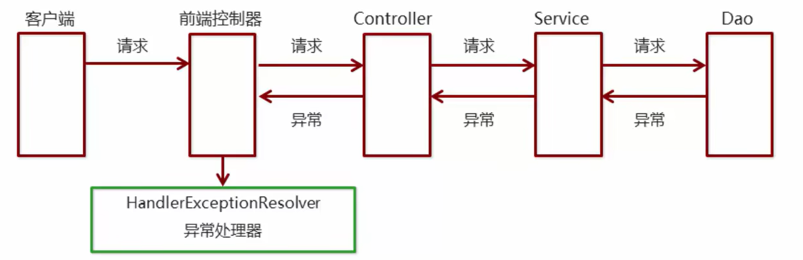

## 异常处理机制

系统中异常包括预期异常和运行时异常，前者通过捕获异常从而获取异常信息，后者主要通过规范代码开发、测试等手段减少运行时异常的发生

系统的`Dao`、`Service`、`Controller`出现异常通过`throws Exception`依次向上抛出，最后由`SpringMVC`前端控制器交由异常处理器进行异常处理，基本流程图如下：



***

### 异常处理方式

`SpringMVC`异常处理方式有两种：

- 使用`SpringMVC`提供的简单的映射异常处理器`SimpleMappingExceptionResolver`

  对于某个异常，跳转到对应的错误页面，是一种异常和要跳转页面的映射关系

  `SpringMVC`已经定义好了该类型转换器，在使用时可以根据项目情况进行相应异常与视图的映射配置

  ```xml
  <bean class="org.springframework.web.servlet.handlez.SimpleMappingExceptionResolver">
      <property name="defaultErrorView" value="error"/>   <!--默认异常的错误视图-->
      <property name="exceptionMappings">
          <map>
              <entry key="com.itheima.exception.MyException" value="error1">
              <entry key="java.lang.ClassCastException" value="error2"/>
          </map>
      </property>
  </bean>
  ```

  > `<entry key="com.itheima.exception.MyException" value="error1">`中`key`表示具体的异常类型，`value`表示配置对应的错误视图
  >
  > 对于自定义的异常的建立：
  >
  > ```java
  > public void show() throws MyException {
  >  System.out.println("自定义异常...");
  >  throw new MyException();
  > }
  > ```

- 实现`Spring`的异常处理接口`HandlerExceptionResolver`自定义自己的异常处理器

  自定义异常处理步骤：

  1. 创建异常处理器类实现`HandlerExceptionResolver`接口

     ```java
     package com.jlc.resolver;
     
     import org.springframework.web.servlet.HandlerExceptionResolver;
     import org.springframework.web.servlet.ModelAndView;
     import javax.servlet.http.HttpServletRequest;
     import javax.servlet.http.HttpServletResponse;
     
     public class MyExceptionResolver implements HandlerExceptionResolver {
         @Override
         /*
         	参数Exception表示异常对象
         	返回值ModelAndVie表示跳转到错误视图的信息
         */
         public ModelAndView resolveException(HttpServletRequest request, HttpServletResponse response, Object handler, Exception exception) {
            ModelAndView modelAndView = new ModelAndView();
            // 判断异常类型
            if (exception instanceof MyException) {
                modelAndView.addObject("info", "自定义异常");
            } else if(exception instanceof ClassCastException) {
                modelAndView.addObject("info", "类型转换异常");
            }
            // 设置跳转的视图
            modelAndView.setViewName("error");
            return modelAndView;
     	}
     }
     ```

  2. 在`spring-mvc.xml`配置异常处理器

     ```xml
     <bean class="com.jlc.resolver.MyExceptionResolver"/>
     ```

  3. 编写异常页面`error.jsp`

     ```html
     <%@page contentType="text/html;charset=UTF-8" language="java" %>
     <html>
     <head>
         <title>Title</title>
     </head>
     <body>
         <h1>通用的错误提示页面</h1>
         <h1>${info}</h1>
     </body>
     </html>
     ```

