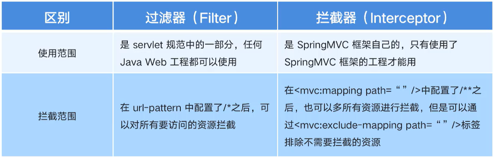
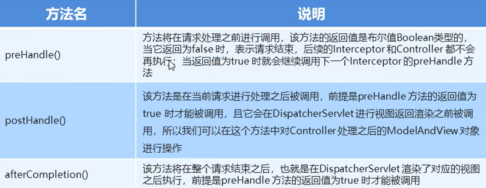

## 拦截器

`SpringMVC`中的拦截器（`interceptor`，对访问资源方法时做一些相应的干预）类似于`Servlet`开发中的过滤器`Filter`，用于处理器进行预处理和后处理，将拦截器按一定的顺序联结成一条链，这条链称为拦截器链，在访问被拦截的方法或字段时，拦截器链中的拦截器就会按其之前定义的顺序被调用。

拦截器也是`AOP`思想的具体实现

拦截器和过滤器的区别：



`SpringMVC`中的拦截器对应的方法：



***

### 自定义拦截器

自定义拦截器的步骤：

1. 创建拦截器类实现`Handlerlnterceptor`接口

   ```java
   package com.jlc.interceptor;
   
   import org.springframework.web.servlet.Handlerlnterceptor;
   
   public class MyInterceptor1 implements Handlerlnterceptor {
       @Override
       // 在目标方法执行之前执行的方法，如果该方法返回false，后续操作都会被拦截，即不会执行
       public boolean preHandle(HttpServletRequest request, HttpServletResponse response, Object handler) throws Exception {
           String param = request.getParameter("param");
           if("yes".equals(param)) {  // 如果获取的内容携带参数，放行
               return true;
           } else {   // 否则跳转到错误页面
               request.getRequestDispatcher("/error.jsp").forward(request, response);
               return false;
           }
       }
   
       @Override
       // 在目标方法执行之后，视图对象返回之前执行的方法，可以通过ModelAndView将模型和视图进行修改
       public void postHandle(HttpServletRequest request, HttpServletResponse response, Object handler, ModelAndView modelAndView) throws Exception {
           // 对模型数据的内容进行修改
           modelAndView.addObject("name", "JLC");   // 最后页面渲染的内容被改为了JLC
       }
   
       @Override
       // 在整个流程都执行完毕后执行的方法，用的比较少
       public void afterCompletion(HttpServletRequest request, HttpServletResponse response, Object handler, Exception ex) throws Exception {
           
       }
   }
   ```

2. 在`spring-mvc.xml`中配置拦截器

   ```xml
   <mvc:interceptors>
       <mvc:interceptor>
       	<!--对哪些资源执行拦截操作 /**表示对所有资源执行拦截操作-->
           <mvc:mapping path="/**"/>
           <bean class="com.jlc.interceptor.MyInterceptor1"/>
       </mvc:interceptor>
   </mvc:interceptors>
   ```

3. 测试拦截器的拦截效果

   对于具体的方法，我们进行拦截：

   ```java
   @Controller
   public class TargetController {
       @RequestMapping("/target")
       public ModelAndView show() {
           System.out.println("目标资源正在执行...");
           ModelAndView modelAndView = new ModelAndView();
           modelAndView.addObject("name", "jlc");
           modelAndView.setViewName("index");
           return modelAndView;
       }
   }
   ```

   > 如果拦截器的`preHandle`方法返回`false`，`show()`方法不会被执行，且`postHandle`和`afterCompletion`方法也不会执行
   >
   > 如果拦截器的`preHandle`方法返回`true`，`show()`、`postHandle`和`afterCompletion`方法都会执行
   >
   > 客户端浏览器输入`http://localhost:8080/target`，没有携带参数，拦截器会进行拦截，不会进行放行，页面会跳转到`error`页面；如果客户端浏览器输入`http://localhost:8080/target?param=yes`，拦截器不会进行拦截，方法正常访问，但是`param`的内容如果不为`yes`，也是会被拦截器拦截的

***

### 自定义拦截器链

1. 创建多个拦截器类，并且都实现`Handlerlnterceptor`接口

   第一个拦截器：

   ```java
   package com.jlc.interceptor;
   
   import org.springframework.web.servlet.Handlerlnterceptor;
   
   public class MyInterceptor1 implements Handlerlnterceptor {
       @Override
       // 在目标方法执行之前执行的方法，如果该方法返回false，后续操作都会被拦截，即不会执行
       public boolean preHandle(HttpServletRequest request, HttpServletResponse response, Object handler) throws Exception {
           String param = request.getParameter("param");
           if("yes".equals(param)) {  // 如果获取的内容携带参数，放行
               return true;
           } else {   // 否则跳转到错误页面
               request.getRequestDispatcher("/error.jsp").forward(request, response);
               return false;
           }
       }
   
       @Override
       // 在目标方法执行之后，视图对象返回之前执行的方法，可以通过ModelAndView将模型和视图进行修改
       public void postHandle(HttpServletRequest request, HttpServletResponse response, Object handler, ModelAndView modelAndView) throws Exception {
           // 对模型数据的内容进行修改
           modelAndView.addObject("name", "JLC");   // 最后页面渲染的内容被改为了JLC
       }
   
       @Override
       // 在整个流程都执行完毕后执行的方法，用的比较少
       public void afterCompletion(HttpServletRequest request, HttpServletResponse response, Object handler, Exception ex) throws Exception {
           System.out.println("afterCompletion");
       }
   }
   ```

   第二个拦截器：

   ```java
   package com.jlc.interceptor;
   
   import org.springframework.web.servlet.Handlerlnterceptor;
   
   public class MyInterceptor2 implements Handlerlnterceptor {
       @Override
       // 在目标方法执行之前执行的方法，如果该方法返回false，后续操作都会被拦截，即不会执行
       public boolean preHandle(HttpServletRequest request, HttpServletResponse response, Object handler) throws Exception {
           System.out.println("preHandle2");
           return true;
       }
   
       @Override
       // 在目标方法执行之后，视图对象返回之前执行的方法，可以通过ModelAndView将模型和视图进行修改
       public void postHandle(HttpServletRequest request, HttpServletResponse response, Object handler, ModelAndView modelAndView) throws Exception {
           System.out.println("postHandle2");
       }
   
       @Override
       // 在整个流程都执行完毕后执行的方法，用的比较少
       public void afterCompletion(HttpServletRequest request, HttpServletResponse response, Object handler, Exception ex) throws Exception {
           System.out.println("afterCompletion2");
       }
   }
   ```

2. 在`spring-mvc.xml`中配置拦截器链

   ```xml
   <mvc:interceptors>
       <mvc:interceptor>
           <!--配置拦截器链：拦截器1在前，拦截器2在后-->
       	<!--对哪些资源执行拦截操作 /**表示对所有资源执行拦截操作-->
           <mvc:mapping path="/**"/>
           <bean class="com.jlc.interceptor.MyInterceptor1"/>
       </mvc:interceptor>
       <mvc:interceptor>
       	<!--对哪些资源执行拦截操作 /**表示对所有资源执行拦截操作-->
           <mvc:mapping path="/**"/>
           <bean class="com.jlc.interceptor.MyInterceptor2"/>
       </mvc:interceptor>
   </mvc:interceptors>
   ```

3. 测试拦截器的拦截效果

   对于具体的方法，我们进行拦截：

   ```java
   @Controller
   public class TargetController {
       @RequestMapping("/target")
       public ModelAndView show() {
           System.out.println("目标资源正在执行...");
           ModelAndView modelAndView = new ModelAndView();
           modelAndView.addObject("name", "jlc");
           modelAndView.setViewName("index");
           return modelAndView;
       }
   }
   ```

   > 对于拦截器链的执行顺序，先后顺序如下：拦截器1的`preHandle`方法，拦截器2的`preHandle`方法，`show()`方法，拦截器2的`postHandle`方法，拦截器1的`postHandle`方法，拦截器2的`afterCompletion`方法，拦截器1的`afterCompletion`方法

***

### 用户登录权限控制

案例：用户登录权限控制，如果用户没有登录，则不能进行相关的操作，需要跳转到登录页面

具体拦截器的配置：

```java
package com.jlc.interceptor;

import com.jlc.domain.User;
import org.springframework.web.servlet.Handlerlnterceptor;
import javax.servlet.http.HttpServletRequest;
import javax.servlet.http.HttpServletResponse;
import javax.servlet.http.HttpSession;

public class PrivilegeInterceptor implements Handlerlnterceptor {
    @Override
    // 只需重写preHandle方法即可
    public boolean preHandle(HttpServletRequest request, HttpServletResponse response, Object handler) throws Exception {
        // 判断用户是否登录，本质就是判断session中有没有user
        HttpSession session = request.getSession();
        User user = (User) session.getAttribute("user");
        if(user == null) {
            // 没有登录，进行拦截，跳转到登录页面
            response.sendRedirect(request.getContextPath()+"/login.jsp");
            return false;
        }
        return true;
    }
}
```

> `session`是存储于服务器端的特殊对象，服务器会为每一个游览器(客户端)创建一个唯一的`session`

在`spring-mvc.xml`中配置拦截器链，同时要放行登录方法的资源

```xml
<mvc:interceptors>
    <mvc:interceptor>
    	<!--对哪些资源执行拦截操作 /**表示对所有资源执行拦截操作-->
        <mvc:mapping path="/**"/>
        <!--配置哪些资源排除拦截操作，放行登录方法资源-->
        <mvc:exclude-mapping path="user/login"/>
        <bean class="com.jlc.interceptor.PrivilegeInterceptor"/>
    </mvc:interceptor>
</mvc:interceptors>
```

