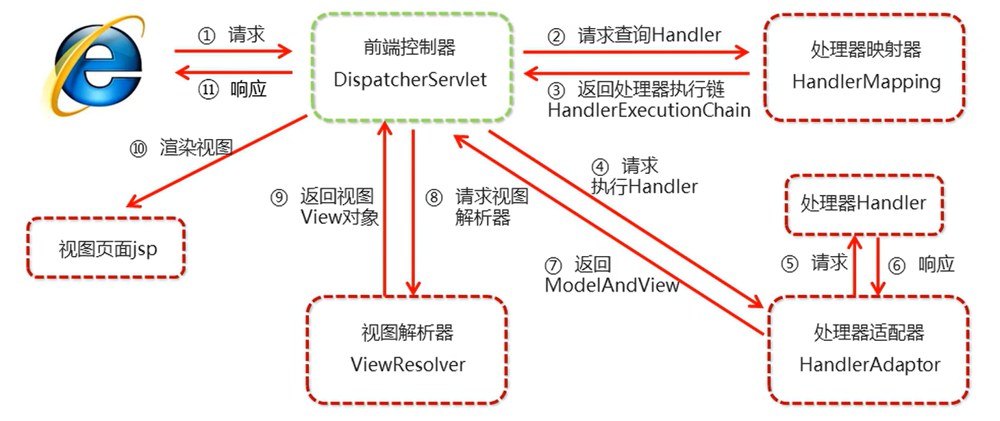

## 组件解析

`SpringMVC`底层的组件是如何进行实现的，我们需要对组件进行解析

在`SpringMVC`框架的内部，很多功能都由对应的组件帮助我们去完成（组件间分工明确）

`SpringMVC`的执行流程图：

1. 用户发送请求至前端控制器`DispatcherServlet`（该前端控制器主要负责调度，进行相应的组件调用）
2. `DispatcherServlet`收到请求调用`HandlerMapping`处理器映射器（该组件用于找资源，解析资源，对请求进行解析，最终具体找哪个，返回处理器执行链，返回的是一串资源的地址，内部封装了具体资源执行的顺序）
3. 处理器映射器找到具体的处理器（可以根据`xml`配置、注解进行查找），生成处理器对象及处理器拦截器（如果有则生成）一并返回给`DispatcherServlet`
4. `DispatcherServlet`调用`HandlerAdapter`处理器适配器（前端控制器拿到返回的处理器执行链后，调用处理器适配器，让其处理调用哪些要被执行的资源）
5. `HandlerAdapter`经过适配器调用具体的处理器（`Controller`，也叫后端控制器，一般是我们自己写的资源封装的对象）
6. `Controller`执行完返回`ModelAndView`（模型和视图对象）
7. `HandlerAdapter`（处理器适配器）将`controller`执行结果`ModelAndView`返回给`DispatcherServlet`（前端控制器）
8. `DispatcherServlet`将`ModelAndView`传给`ViewReslover`视图解析器（从`ModelAndView`中将视图`View`对象解析出来）
9. `ViewReslover`解析后返回具体的`View`
10. `DispatcherServlet`根据`View`进行渲染视图（即将模型数据填充至视图中），`DispatcherServlet`响应用户