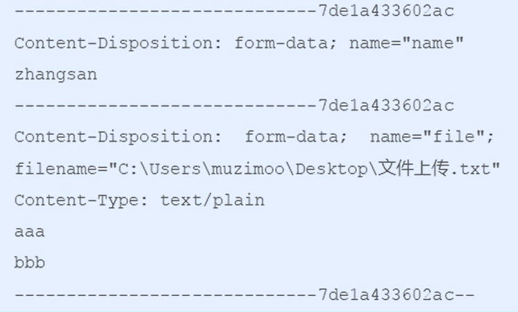

## 获取请求数据

客户端请求参数的格式是`name=value&name=value...`

服务器端要获得请求的参数，有时还需要进行数据的封装，`SpringMVC`可以接收如下类型的参数：基本类型参数、`POJO`类型参数、数组类型参数和集合类型参数

***

### 获取基本类型参数

`Controller`中的业务方法的参数名称要与请求参数的`name`一致，参数值会自动映射匹配封装。

对于浏览器中地址的参数输入：`http://localhost:8080/quick?username=jlc&age=25`

获取浏览器传入的基本类型参数：

```java
@RequestMapping("/quick")
@ResponseBody
public Void quickMethod(String username, int age) throws IOException {
    System.out.println(username);   // jlc
    System.out.println(age);   // 25
}
```

当请求的参数名称与`Controller`的业务方法参数名称不一致时，就需要通过`@RequestParam`注解显示绑定与形参的关系：

```java
@RequestMapping("/quick")
@ResponseBody
public Void quickMethod(@RequestParam("name") String username) throws IOException {
    System.out.println(username);   // jlc
}
```

> 将请求的`name`参数，映射到对应的`username`参数

在浏览器地址栏输入`http://localhost:8080/quick?name=jlc`

***

### 获取`POJO`类型参数

客户端发送的数据，到达服务端`Web`层，`SpringMVC`会自动的将参数封装到一个实体中，`Controller`中的业务方法的`POJO`参数的属性名与请求参数的`name`一致，参数值会自动映射匹配。

对于浏览器中地址的参数输入：`http://localhost:8080/quick?username=jlc&age=25`

对于一个`User`对象：

```java
package com.jlc.domain;

public class User {
    private String username;
    private int age;
    public String getUsername() { return username; }
    public void setUsername(String username) { this.username = username; }
    public int getAge() { return age; }
    public void setAge(int age) { this.age = age; }
    public String toString() {
        return "User{" + "username='" + username + '\'' + ", age=" + age + '}';
    }
}
```

获取`POJO`类型参数：`SpringMVC`会自动的将接收的参数封装到`user`对应的属性中，在方法内部使用即可

```java
@RequestMapping("/quick")
@ResponseBody
public Void quickMethod(User user) throws IOException {
    System.out.println(user);   // User{username='jlc', age=25}
}
```

***

### 获取数组类型参数

`Controller`中的业务方法数组名称与请求参数的`name`一致，参数值会自动的映射匹配。

对于浏览器中地址的参数输入：`http://localhost:8080/quick?strs=aaa&strs=bbb&strs=ccc`

获取数组类型参数：

```java
@RequestMapping("/quick")
@ResponseBody
public Void quickMethod(String[] strs) throws IOException {
    System.out.println(Arrays.asList(strs));  // [aaa, bbb, ccc]
}
```

***

### 获取集合类型参数

- 获取集合类型参数时，要将集合参数包装到一个`POJO`对象中才可以，这个对象中有我们要封装的集合

  创建提交数据页面：`form.jsp`

  ```html
  <%@page contentType="text/html;charset=UTF-8" language="java" %>
  <html>
  <head>
      <title>Title</title>
  </head>
  <body>
      <form action="${pageContext.request.contextPath}/quick" method="post">
      	<!--表明是第一个User对象的username和age-->
          <input type="text" name="userList[0].username"><br/>
          <input type="text" name="userList[0].age"><br/>
          <!--表明是第二个User对象的username和age-->
          <input type="text" name="userList[1].username"><br/>
          <input type="text" name="userList[1].age"><br/>
          <input type="submit" value="提交">
      </form>
  </body>
  </html>
  ```

  在浏览器地址栏中输入：`http://localhost:8080/form.jsp`

  在表单中输入具体用户的`username`和`age`，并进行提交

  > 但是，如果以当前的方式进行表单的提交，当提交的内容出现中文，获取的集合参数类型数据会出现乱码，我们可以设置一个过滤器来进行乱码的过滤，在`web.xml`进行配置：
  >
  > ```xml
  > <!--配置全局过滤的filter-->
  > <filter>
  >  <filter-name>CharacterEncodingFilter</filter-name>
  >  <filter-class>org.springframework.web.filter.CharacterEncodingFilter</filter-class>
  >  <!--指定具体的编码方式-->
  >  <init-param>
  >      <param-name>encoding</param-name>
  >      <param-value>UTF-8</param-value>
  >  </init-param>
  > </filter>
  > <filter-mapping>
  >  <filter-name>CharacterEncodingFilter</filter-name>
  >  <url-pattern>/*</url-pattern>  <!--对所有的资源都进行编码设置-->
  > </filter-mapping>
  > ```

  创建一个`POJO`对象：

  ```java
  package com.jlc.domain;
  
  public class VO {
      private List<User> userList;
      public List<User> getUserList() {
          return userList;
      }
      public void setUserList(List<User> userList) {
          this.userList = userList;
      }
      public String toString() {
          return "VO{" + "userList='" + userList + '}';
      }
  }
  ```

  获取集合类型参数：

  ```java
  @RequestMapping("/quick")
  @ResponseBody
  public Void quickMethod(VO vo) throws IOException {
      System.out.println(vo);  // VO{userList=[User{username='jlc', age=25}, User{username='lisi', age=20}]}
  }
  ```

- 但是，当使用`ajax`提交时，可以指定`contentType`为`json`形式，那么在方法参数位置使用`@RequestBody`可以直接接收集合数据而无需使用`POJO`进行包装

  创建提交数据页面：`ajax.jsp`，使用`ajax`首先需要引入`jquery.js`文件

  ```html
  <%@page contentType="text/html;charset=UTF-8" language="java" %>
  <html>
  <head>
      <title>Title</title>
  </head>
  <body>
      <script src="${pageContext.request.contextPath}/js/jquery-3.3.1.js"></script>
      <script>
      	var usserList = new Array();
          userList.push({username:"jlc", age=25});
          userList.push({username:"lisi", age=20});
          
          // 发送ajax请求
          $.ajax({
              type:"POST",
              url:"${pageContext.request.contextPath}/quick",
              data:JSON.stringify(userList),
              contentType:"application/json;charset=utf-8"
          })
      </script>
  </body>
  </html>
  ```

  > 为了可以正常的导入静态资源：`<script src="${pageContext.request.contextPath}/js/jquery-3.3.1.js"></script>`
  >
  > 需要在`spring-mvc.xml`配置文件中加入一句配置，从而开启静态资源的访问：
  >
  > ```xml
  > <mvc:resources mapping="/js/**" location="/js/"/>
  > ```
  >
  > 上述代码表示，在`SpringMVC`框架中，要开放对哪些资源（一般都是静态资源）的访问权限
  >
  > `mapping`：表示映射地址；`location`：表示哪个目录下的资源是对外开放的，`/`表示`webapp`文件夹
  >
  > 我们也可以将上述代码改写为：该方法也是在企业中经常用到的
  >
  > ```xml
  > <mvc:default-servlet-handler/>
  > ```
  >
  > 在访问资源时，`SpringMVC`找对应的匹配地址（如`quick`），如果找不到就交给原始的容器，让原始的容器去找静态资源，一般情况下原始的容器是可以访问静态资源的

  在浏览器地址栏中输入：`http://localhost:8080/ajax.jsp`

  在服务端直接进行获取集合类型参数：

  ```java
  @RequestMapping("/quick")
  @ResponseBody
  public Void quickMethod(@RequestBody List<User> userList) throws IOException {
      System.out.println(userList);  // [User{username='jlc', age=25}, User{username='lisi', age=20}]
  }
  ```

  > `@RequestBody`表示将请求体的内容，直接封装到后面对应的集合中

***

### 获取`Restful`风格的参数

#### `RESTful `风格

`RESTful `是一种软件架构风格和设计风格，而不是标准。它提供了一组设计原则和约束条件，主要用于客户端和服务器交互类的软件。基于` RESTful `风格设计的软件可以更简洁、更有层次，并且更易于实现缓存等机制。

`RESTful `风格的请求是使用`url+请求方式`表示一次请求目的，`HTTP`协议里面四个表示操作（请求方式）如下：

- `GET`：用于获取资源
- `POST`：用于新建资源
- `PUT`：用于更新资源
- `DELETE`：用于删除资源

如`/user/1 GET`：得到`id=1`的`user`

#### 获取`Restful`风格的参数

`url地址/user/1`中的1就是要获得的请求参数，在`SpringMVC`中可以使用占位符进行参数绑定，`url地址/user/1`可以写成`url地址/user/{id}`，占位符`{id}`对应的就是1的值。在业务方法中我们可以使用`@PathVariavle`注解进行占位符的匹配获取工作

对应客户端浏览器输入的地址：`http://localhost:8080/quick/jlc`

获取`Restful`风格的参数：

```java
@RequestMapping("/quick/{name}")   // {name}是占位的，获取请求地址的对应内容
@ResponseBody
public Void quickMethod(@PathVariavle(value="name", required=true) String name) throws IOException {
    System.out.println(name);  // jlc
}
```

> `@PathVariavle(value="name", required=true)`中的`name`要和`@RequestMapping("/quick/{name}")`中的`name`一致

***

### 自定义类型转换器

`SpringMVC`内部已经定义好了一些常用的类型转换器，如客户端提交的字符串转换成`int`类型的参数设置

但是，不是所有的数据类型都提供了转换器，没有提供的就需要我们自定义类型转换器，如日期类型的数据就需要自定义转换器

自定义类型转换器的开发步骤：

1. 定义转换器类实现`Converter`接口

   ```java
   package com.jlc.converter;
   
   import org.springframework.core.convert.converter.Converter;
   import java.util.Date;
   import java.text.SimpleDateFormat;
   
   // 定义日期类型的数据转换器
   public class DateConverter implements Converter<String, Date> {
       public Date convert(String dateStr) {
           // 将日期字符串转换成日期对象进行返回
           SimpleDateFormat format = new SimpleDateFormat("yyyy-MM-dd");  // 目标格式
           Date date = null;
           try {
               date = format.parse(dateStr);
           } catch (ParseException e) {
               e.printStackTrace();
           }
           return date;
       }
   }
   ```

2. 在配置文件`spring-mvc.xml`中声明自定义的转换器

   ```xml
   <!--声明转换器-->
   <bean id="conversionService" class="org.springframework.context.support.ConversionServiceFactoryBean">
       <property name="converters">
           <list>
               <!--声明自定义的日期转换器-->
               <bean class="com.jlc.converter.DateConverter"></bean>
           </list>
       </property>
   </bean>
   
   <!--自定义转换器的注册-->
   <mvc:annotation-driven conversion-service="conversionService"/>
   ```

3. 在`<annotation-driven>`中引用转换器

在浏览器地址栏中输入：`http://localhost:8080/quick?date=2025-05-21`（不使用自定义转换器会报错）

> 默认情况`http://localhost:8080/quick?date=2025/05/21`是不会报错的

```java
@RequestMapping("/quick")
@ResponseBody
public Void quickMethod(Date date) throws IOException {
    System.out.println(date);   // Wed May 21 00:00:00 CST 2025
}
```

***

### 获取`Servlet`相关`API`

`SpringMVC`支持使用原始`ServletAPI`对象作为控制器方法的参数进行注入，常用的对象如下：

- `HttpServletRequest`
- `HttpServletResponse`
- `HttpSession`

对于原始`ServletAPI`对象的获取，我们只需要在对应方法的位置注入形参即可

```java
@RequestMapping("/quick")
@ResponseBody
public Void quickMethod(HttpServletRequest request, HttpServletResponse response, HttpSession session) throws IOException {
    System.out.println(request);
    System.out.println(response);
    System.out.println(session);
}
```

> 重要思想：`quickMethod`方法是框架进行调用的，方法内部的参数是形参，谁调用方法，谁负责传递实际的参数，`SpringMVC`框架去调用这个方法，当需要这些参数时，就会进行传递

***

### 获取请求头的数据

对于`Http`数据，除了请求数据之外，还有请求头和请求行数据，在浏览器控制台中可以通过网络进行抓包，`Response Headers`表示响应头；`Request Headers`表示请求头

- 对于请求头的数据（键值对形式的数据），偶尔也会使用，通过`@RequestHeader`注解就可以获取请求头数据，该注解的属性有：

  - `value`：请求头的名称
  - `required`：是否必须携带此请求头

  ```java
  @RequestMapping("/quick")
  @ResponseBody
  public Void quickMethod(@RequestHeader(value="User-Agent", required=false) String headerValue) throws IOException {
      System.out.println(headerValue);
  }
  ```

  > 请求头中的`User-Agent`表示当前客户端浏览器的信息

- 通过`@CookieValue`注解获取请求头中的`Cookie`的值（`session`的一种标识，其值一般是一个键值对`JSESSIONID=xxxxxx`），`@CookieValue`注解的属性如下：

  - `value`：指定`cookie`的名称
  - `required`：是否必须携带此`cookie`

  ```java
  @RequestMapping("/quick")
  @ResponseBody
  public Void quickMethod(@CookieValue(value="JSESSIONID", required=false) String jsessionid) throws IOException {
      System.out.println(jsessionid);
  }
  ```

***

### 文件上传

文件上传客户端的三要素：

- 表单项`type="file"`
- 表单的提交方式是`post`
- 表单的`enctype`属性是多部分表单形式，及`enctype="multipart/form-data"`

```html
<form action="${pageContext.request.contextPath}/quick" method="post" enctype="multipart/form-data">
    名称：<input type="text" name="name"></br>
	文件：<input type="file" name="file"></br>
	<input type="submit" value="提交"></br>
</form>
```

> 文件上传的原理：
>
> - 当`form`表单修改为多部分表单时，`request.getParameter()`将失效
>
> - `enctype= "application/x-www-form-urlencoded" `时，`form`表单的正文内容格式是键值对的形式：`key=value&key=value&key=value`
>
> - 当`form`表单的`enctype`取值为`Multipart/form-data`时，请求正文内容就变成多部分形式：
>
>   
>
>   其中`aaa bbb`表示文件中的具体内容，服务端可以获得当前表单的所有数据，包括文件里面的数据

#### 单文件上传

单文件上传的步骤：

1. 在`pom.xml`配置文件中导入`fileupload`和`io`坐标

   ```xml
   <dependency>
       <groupId>commons-fileupload</groupId>
       <artifactId>commons-fileupload</artifactId>
       <version>1.2.2</version>
   </dependency>
   <dependency>
       <groupId>commons-io</groupId>
       <artifactId>commons-io</artifactId>
       <version>2.4</version>
   </dependency>
   ```

2. 在`spring-mvc.xml`配置文件中配置文件上传解析器

   ```xml
   <bean id="multipartResolver" class="org.springframework.web.multipart.commons.CommonsMultipartResolver">
       <!--上传文件总大小-->
       <property name="maxUploadSize" value="5242800"/>
       <!--上传单个文件的大小-->
       <property name="maxUploadSizePerFile" value="5242800"/>
       <!--上传文件的编码类型-->
       <property name="defaultEncoding" value="UTF-8"/>
   </bean>
   ```

3. 编写文件上传代码

   ```java
   @RequestMapping("/quick")
   @ResponseBody
   public void quickMethod(String name, MultipartFile file) throws IOException {
       //获得上传文件的名称
       String originalFilename = file.getOriginalFilename();
       //保存文件，以指定的名称，将文件存放到服务器的磁盘上
       file.transferTo(new File("C:\\upload\\" + originalFilename));
   }
   ```

   > `SpringMVC`会将文件封装成一个对象，及`MultipartFile file`其对象的名称要和表单中文件输入框的名称一致

#### 多文件上传

对表单项进行修改，使其可以上传多个文件：

```html
<form action="${pageContext.request.contextPath}/quick" method="post" enctype="multipart/form-data">
    名称：<input type="text" name="name"></br>
	文件1：<input type="file" name="file1"></br>
	文件2：<input type="file" name="file2"></br>
	<input type="submit" value="提交"></br>
</form>
```

编写文件上传代码

```java
@RequestMapping("/quick")
@ResponseBody
public void quickMethod(String name, MultipartFile file1, MultipartFile file2) throws IOException {
    //获得上传文件的名称
    String originalFilename1 = file1.getOriginalFilename();
    String originalFilename2 = file2.getOriginalFilename();
    //保存文件，以指定的名称，将文件存放到服务器的磁盘上
    file1.transferTo(new File("C:\\upload\\" + originalFilename1));
    file2.transferTo(new File("C:\\upload\\" + originalFilename2));
}
```

如果表单上传的文件`name`属性值都一样：

```html
<form action="${pageContext.request.contextPath}/quick" method="post" enctype="multipart/form-data">
    名称：<input type="text" name="name"></br>
	文件1：<input type="file" name="file"></br>
	文件2：<input type="file" name="file"></br>
	<input type="submit" value="提交"></br>
</form>
```

对应的文件上传代码要修改，使用数组的方式进行循环接收：

```java
@RequestMapping("/quick")
@ResponseBody
public void quickMethod(String name, MultipartFile[] file) throws IOException {
    for (MultipartFile multipartFile : file) {
        String originalFilename = multipartFile.getOriginalFilename();
        multipartFile.transferTo(new File("C:\\upload\\" + originalFilename));
    }
}
```

