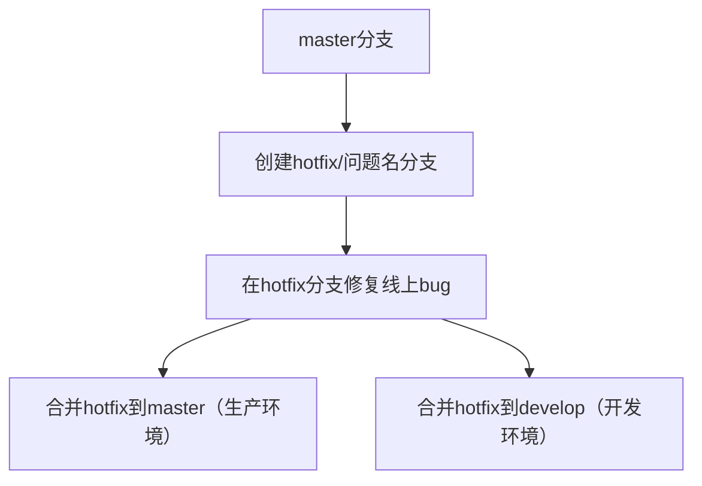
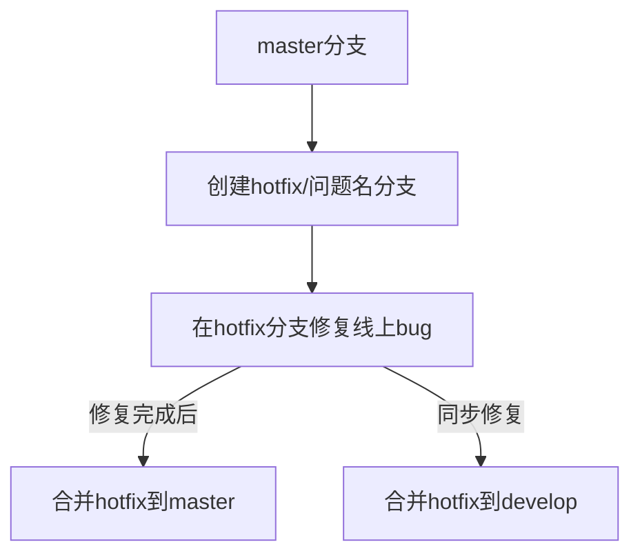

## Mermaid流程图语法

### 一、语法类型：Mermaid 流程图语法（TD 方向的流程图）
你提供的这段代码是 **Mermaid 语法** 中「自上而下（Top-Down，简称 TD）的流程图」定义语法，Mermaid 是一种基于文本的图表描述语言，可将纯文本转换为可视化流程图、时序图、甘特图等，被广泛支持于 Markdown 编辑器（如 Typora、GitBook、GitHub/Gitee、语雀等）。

#### 核心语法拆解
| 语法片段               | 含义说明                                                                 |
|------------------------|--------------------------------------------------------------------------|
| `graph TD`             | 声明图表类型为「流程图」，`TD` 表示「自上而下」的布局方向（可选：LR 自左向右、BT 自下而上等） |
| `A[master分支]`        | 定义节点：`A` 是节点唯一标识（自定义），`[xxx]` 是节点显示文本（支持中文/特殊字符） |
| `-->`                  | 定义节点间的「连接线」，表示流程的先后关系（可简化为 `---`，或增强为 `-- 说明文字 -->`） |
| `B[创建hotfix/问题名分支]` | 第二个节点，标识为 `B`，显示文本为具体操作步骤                           |
| 多分支指向（C→D/C→E）| 表示节点 `C` 完成后，同时触发 `D` 和 `E` 两个并行操作（逻辑上的「同时执行」） |

#### 扩展语法（可选）
如果需要给连接线加说明，可修改为：

或更精准的并行说明：


### 二、语法效果
#### 1. 可视化效果（核心）
这段语法会被 Mermaid 渲染为**自上而下的可视化流程图**，最终呈现效果如下：
```
master分支
    ↓
创建hotfix/问题名分支
    ↓
在hotfix分支修复线上bug
    ↓
┌─────────────────────┐
│                     │
▼                     ▼
合并hotfix到master   合并hotfix到develop
（生产环境）        （开发环境）
```
直观展示「线上紧急修复（hotfix）」的完整流程：从主分支拉取修复分支 → 修复 bug → 同步合并回主分支（生产）和开发分支（避免后续版本丢失修复）。

#### 2. 逻辑表达效果
- **流程闭环**：清晰定义了 hotfix 分支的「来源（master）→ 操作（修复）→ 去向（master+develop）」，无遗漏关键步骤；
- **并行逻辑**：通过 `C→D` 和 `C→E` 两条连接线，明确「修复完成后需同时合并到两个分支」的核心规则（这是 Git 分支管理中 hotfix 流程的关键，避免只修复生产、开发分支遗漏问题）；
- **易维护性**：纯文本语法，比手绘/截图流程图更易修改、版本控制（可直接提交到 Git 仓库，随文档同步更新）；
- **跨平台兼容**：支持所有兼容 Mermaid 的工具，无需额外安装绘图软件，复制粘贴即可渲染。

### 三、适用场景
1. **技术文档**：嵌入到 Git 分支管理 SOP、开发规范文档中，替代纯文字描述，降低理解成本；
2. **团队协作**：在会议、培训中快速展示流程，统一团队对 hotfix 操作的认知；
3. **自动化渲染**：结合 Markdown 生成静态网站/接口文档时，自动渲染为流程图，无需手动调整格式。

### 总结
该语法是 Mermaid 标准化的流程图描述语法，核心价值是「用极简的文本定义复杂流程，自动生成可视化图表」，既保证了文本的可编辑性/版本可控性，又解决了纯文字流程描述的晦涩问题，是技术文档中流程说明的最优实践之一。